# 1\.Introducción
La clasificación automática de imágenes médicas se ha convertido en un apoyo importante para el diagnóstico clínico, especialmente en situaciones donde es necesario identificar patologías a partir de estudios de imágenes. En el caso de las radiografías de tórax, reconocer de manera temprana condiciones como la neumonía es clave en términos de salúd pública. Tradicionalmente, los procesos computacionales se han basado en descriptores de forma, textura e intensidad diseñados manualmente, combinados con clasificadores clásicos como SVM, k-NN o Random Forest. Sin embargo, el avance de la redes neuronales convolucionales (CNN) en los últimos años ha cambiado este panorama, ya que permiten aprender directamente de los datos y superando en muchos casos el desempeño de los métodos clásicos. 

El actual trabajo tiene como fin desarrollar y comparar el desempeño de ambos enfoques, considerando descriptores handcrafted y modelos basados en deep learning, para lograr diferenciar radiografías de tórax de pacientes con o sin neumonía. El proceso se estructura en tres fases principales: análisis exploratorio y procesamiento del conjunto de datos; diseño y extracción de descriptores clásicos con clasificadores tradicionales, finalmente, entrenamiento de modelos convolucionales .

# 2\. Marco teórico

## 2.1. Análisis Exploratorio y Preprocesamiento
El preprocesamiento de imágenes es una etapa fundamental en los sistemas de visión por computador,  su objetivo es normalizar las imágenes de entrada, reducir la variabilidad no deseada y garantizar que los algoritmos de extracción de características y clasificación trabajen sobre datos coherentes y comparables.

Para el análisis exploratorio, se utiliza la visualización inicial de ejemplos representativos, esto permite identificar variaciones en calidad, contraste y patrones anatómicos entre clases, lo cual es clave para anticipar posibles retos en la clasificación. El análisis de la distribución de clases revela la presencia de desbalance, un factor crítico que puede influir en el desempeño de los modelos de aprendizaje automático. De igual forma, examinar la distribución de los tamaños originales de las imágenes permite evidenciar la heterogeneidad propia de los estudios radiológicos provenientes de diferentes equipos, lo que justifica la necesidad de normalizar las dimensiones antes de extraer características. Así, se puede obtener una visión global del dataset que permite detectar inconsistencias y orienta la selección adecuada de técnicas de preprocesamiento.

1. Normalización de tamaño, se realiza mediante interpolación y busca unificar resoluciones en modelos que requieren entradas fijas, facilitar la comparación entre imágenes, reducir errores asociados a escalas diferentes, mejorar la reproducibilidad del proceso analítico.

2 Normalización de intensidad:convierte las imágenes a un rango estándar ( [0–255] o [0–1]), reduciendo la influencia de diferencias técnicas y permitiendo una comparación más consistente entre imágenes.

Matemáticamente, una normalización min–max típica se formula como:

$$
I_{\text{norm}} =
\frac{I - I_{\min}}{I_{\max} - I_{\min}}
$$

3. Mejora de contraste mediante CLAHE: Ecualización adaptativa de histograma limitada por contraste (CLAHE) tiene la capacidad de realzar contrastes locales sin amplificar excesivamente el ruido. Para esto, se divide la imagen en bloques pequeños, ecualiza cada uno y limita el contraste máximo permitiendo: resaltar estructuras anatómicas relevantes, mejorar bordes y detalles finos, evitar sobreecualización que podría introducir artefactos, preservar características radiológicas sutiles esenciales para diagnóstico.
	​
4. Segmentación: permite delimitar regiones anatómicas de interés y separar estructuras relevantes del fondo o de tejidos no deseados. En el caso de radiografías de tórax, la creación de máscaras pulmonares facilita el aislamiento del parénquima y reduce la influencia de elementos externos como costillas, tejidos blandos o marcadores técnicos. Este procedimiento no solo mejora la uniformidad del conjunto de datos, sino que también incrementa la precisión de los descriptores de forma y textura al concentrarse exclusivamente en la región anatómica pertinente. Técnicas modernas de segmentación basadas en deep learning —como modelos U-Net entrenados en bases especializadas— permiten generar máscaras robustas incluso ante variabilidad radiológica significativa. En este sentido, la segmentación actúa como un filtro anatómico que optimiza la extracción de características y fortalece el desempeño de los modelos posteriores de clasificación o análisis cuantitativo.

## 2.2 Extracción de Descriptores Clásicos
### 2.2.1 Descriptores de Forma

#### 2.2.1.1 Descriptores de contorno

#### 2.2.1.2 Fourier Shape Descriptors 

Los descriptores de forma de Fourier permiten representar matemáticamente el contorno de un objeto transformándolo en una señal compleja.

$$
Zk = Xk + iYk
$$

A través de la Transformada Discreta de Fourier.

$$
Zn = k=0N-1Zke-i2nk/N
$$

El contorno se descompone en componentes de distintas “frecuencias de forma”. Las bajas frecuencias describen la estructura global del objeto, mientras que las altas capturan detalles finos. Normalizando los coeficientes se logra invariante la traslación, escala y rotación, de modo que la representación depende únicamente de la forma.

En imágenes médicas, esta técnica permite cuantificar y comparar la geometría de estructuras anatómicas. En radiografías de tórax, los descriptores pueden reflejar cambios en la forma pulmonar asociados a patologías como la neumonía, proporcionando una representación compacta y útil para clasificación o análisis automatizado.

#### 2.2.1.3 Momentos de Hu
Los momentos invariantes de Hu, propuestos por Ming-Kuei Hu en 1962, constituyen uno de los descriptores de forma más utilizados en visión por computador debido a su capacidad para representar la geometría de un objeto de manera invariante a traslación, rotación y cambio de escala (Hu, 1962). Estos descriptores se derivan de combinaciones algebraicas de los momentos centrales normalizados de segundo y tercer orden, lo que permite capturar características globales de la forma sin depender de su orientación o tamaño.

El enfoque se basa en los momentos geométricos, definidos para una imagen 𝑓(𝑥,𝑦) como:

$$
m_{pq} = \sum_x \sum_y ( x^p * y^q * f(x, y) )
$$

Los momentos centrales, que introducen invariancia a traslación, se expresan como:

$$
\mu_{pq} = \sum_x \sum_y \big( (x - \bar{x})^p * (y - \bar{y})^q * f(x, y) \big)
$$

donde:

$$
\bar{x} = \frac{m_{10}}{m_{00}}
\qquad
\bar{y} = \frac{m_{01}}{m_{00}}
$$

corresponden al centroide del objeto.

Para lograr invariancia a escala, se introducen los momentos centralizados normalizados:

$$
\eta_{pq} = \frac{\mu_{pq}}{\mu_{00}^{\gamma}}
$$

donde:

$$
\gamma = \frac{p + q}{2} + 1
$$

A partir de estos valores, Hu desarrolló siete combinaciones invariantes, conocidas como Hu Moments, que permiten describir la forma completa del objeto en términos globales,  capturando propiedades tales como:

+Simetría global
+Distribución espacial de masas
+Proporciones y elongación
+Grado de irregularidad
+Relación entre ejes principales

### 2.2.2 Descriptores de Textura

#### 2.2.2.1  Local Binary Patterns (LBP)

#### 2.2.2.2  Gray Level Co-occurrence Matrix (GLCM)
La Matriz de Co-ocurrencia de Niveles de Gris (GLCM) es un método estadístico clásico utilizado para describir la textura en imágenes. En GLCM se calcula la frecuencia con la que pares de píxeles con determinadas intensidades, separados por una distancia específica y en una orientación determinada están presentes en una imagen. Esta información permite capturar patrones de repetición, rugosidad o regularidad de la textura de la imagen.

A partir de la GLCM se pueden extraer varias propiedades que caracterizan la textura de la imagen:

**Contraste:** mide la variación de intensidad entre píxeles vecinos. Valores altos de contraste indican que la imagen tiene transiciones fuertes o bordes marcados, mientras que valores bajos indican regiones más homogéneas.

**Correlación:** evalúa la dependencia lineal entre los niveles de gris de píxeles vecinos. Una correlación alta sugiere que los valores de intensidad están relacionados de manera predecible, mientras que valores bajos reflejan una textura más aleatoria o irregular.

**Energía:** refleja la uniformidad o repetitividad de la textura. Valores altos de energía indican que la imagen contiene patrones repetitivos y homogéneos, mientras que valores bajos indican una textura más heterogénea y variada.

**Homogeneidad:** mide qué tan cercanos están los valores de intensidad a la diagonal principal de la GLCM, lo que se interpreta como el grado de uniformidad local. Una homogeneidad alta indica que los píxeles vecinos tienen intensidades similares, mientras que una homogeneidad baja indica diferencias más pronunciadas entre los niveles de gris de píxeles adyacentes.

Estas propiedades permiten cuantificar y comparar la textura de diferentes regiones o imágenes de manera objetiva, siendo muy útiles en aplicaciones médicas, industriales y de visión por computadora donde la textura es un criterio discriminante importante.

#### 2.2.2.3 Filtros de Gabor
Los filtros de Gabor constituyen una familia de operadores lineales diseñados para analizar simultáneamente la información espacial y de  frecuencia de una imagen. Se basa en la modulación de una función sinusoidal por una envolvente gaussiana, lo que permite lograr localización conjunta en dominio espacial y en dominio de frecuencia. Esta propiedad los convierte en herramientas especialmente adecuadas para la detección de bordes, texturas y estructuras orientadas, características relevantes en imágenes médicas como radiografías de tórax. La expresión general del filtro de Gabor bidimensional es:

$$
g(x, y) =
\exp\left(
-\frac{x'^{2} + \gamma^{2} y'^{2}}{2\sigma^{2}}
\right)
\*
\cos\left(
2\pi \frac{x'}{\lambda} + \psi
\right)
$$

donde las variables rotadas se definen como:

$$
\begin{aligned}
x' &= x \cos(\theta) + y \sin(\theta) \\
y' &= -x \sin(\theta) + y \cos(\theta)
\end{aligned}
$$

Los parámetros del filtro son:
lambda: longitud de onda de la función sinusoidal (controla la frecuencia espacial).
theta: orientación del filtro.
psi: fase de la onda sinusoidal.
sigma: desviación estándar de la envolvente gaussiana.
gamma: relación de aspecto que ajusta la elipticidad del núcleo.

La combinación de estos parámetros permite definir filtros sensibles a distintas escalas y orientaciones, construyendo así un banco de filtros Gabor multi–escala y multi–orientación.

## 2.3 Clasificación con Descriptores Clásicos

### 2.3.1 SVC: Support Vector Machine
La Máquina de Vectores de Soporte (SVM) es un modelo de aprendizaje supervisado ampliamente utilizado para problemas de clasificación.
Su principio se basa en encontrar un hiperplano óptimo que separe de forma máxima las clases en el espacio de características. Para datos no linealmente separables, SVM utiliza funciones núcleo (kernels) que proyectan los datos a un espacio de mayor dimensión donde la separación es posible. Entre los kernels más comunes se encuentran:

**RBF (Radial Basis Function)**: Transforma los datos en un espacio de alta dimensión usando una función gaussiana, permitiendo separar incluso patrones muy complejos y no lineales.

**Polynomial (Poly)**: Proyecta los datos a un espacio de características mediante un polinomio de grado ddd, capturando relaciones no lineales entre las variables.

**Linear:** No realiza transformación, por lo que es útil cuando los datos ya son linealmente separables; su simplicidad hace que sea eficiente y menos propenso a sobreajuste.

El proceso de estandarización de variables es fundamental para SVM, ya que el modelo depende de distancias en el espacio de características.

### 2.3.2 Random Forest
Método de aprendizaje supervisado basado en la combinación de múltiples árboles de decisión para mejorar la precisión predictiva y la capacidad de generalización del modelo (Leo Breiman, 2001). Random Forest pertenece a la familia de los métodos de ensamble, específicamente al enfoque conocido como bagging (bootstrap aggregating), su objetivo es reducir la varianza del modelo mediante el entrenamiento de múltiples clasificadores sobre subconjuntos aleatorios del conjunto de datos. Cada árbol de decisión dentro del bosque se construye utilizando dos tipos de aleatoriedad:

+Muestreo bootstrap: consiste en seleccionar aleatoriamente, con reemplazo, un subconjunto de las instancias originales para entrenar cada árbol.

+Selección aleatoria de atributos: en cada nodo del árbol, se evalúa únicamente un subconjunto aleatorio de características para determinar la mejor división.

Estas fuentes de aleatoriedad reducen la correlación entre árboles, lo que mejora el desempeño del ensamble

* Construcción de árboles
Dado un conjunto de entrenamiento D con N instancias, Random Forest genera B subconjuntos bootstrap:

$$
D_b = \{\, (x_i, y_i) \ \text{seleccionados con reemplazo} \,\},
\qquad
b = 1, 2, \ldots, B
$$

Cada subconjunto tiene tamaño N. Sobre cada D_b se entrena un árbol de decisión T_b.

* Divisiones en los nodos (split function)
En cada nodo del árbol, se selecciona aleatoriamente un subconjunto de k características.Se evalúa una función de pureza para encontrar la mejor división.

* Proceso de votación en clasificación
Una vez entrenados los B árboles, la predicción final para una instancia x se obtiene mediante votación por mayoría:

$$
\hat{y} = \mathrm{mode}( T_1(x), T_2(x), \ldots, T_B(x) )
$$

donde \; T_b(x) \; \text{es la predicción del árbol } b.

En regresión, se toma el promedio:

$$
\hat{y} = \frac{1}{B} \sum_{b=1}^{B} T_b(x)
$$

Algunas ventajas que tiene este modelo son, la reducción de la varianza del modelo sin aumentar significativamente el sesgo , es robusto frente a sobreajuste gracias a la aleatorización, maneja bien datos con ruido y características irrelevantes, puede calcular medidas de importancia de variables, funciona adecuadamente aunque los datos no estén escalados.

### 2.3.3 Convolutional Neural Networks
Las Redes Neuronales Convolucionales (Convolutional Neural Networks, CNN) son modelos de aprendizaje profundo diseñados para procesar datos con estructura espacial, como imágenes médicas. Su funcionamiento se basa en la aplicación de operaciones de convolución, donde filtros aprendidos automáticamente extraen características relevantes del contenido visual. La operación convolucional para un filtro KKK aplicado sobre una imagen se define como:

$$
Y(i,j) = \sum_{m}\sum_{n} X(i+m, j+n)\, K(m,n)
$$

Tras cada convolución se aplica una función de activación, habitualmente ReLU, f(x)=max⁡(0,x)f(x) = \max(0, x), que introduce no linealidad y permite modelar relaciones complejas. Posteriormente, operaciones de pooling, como el max pooling, reducen la dimensionalidad y proporcionan invariancia a pequeñas variaciones espaciales. A medida que se apilan capas convolucionales y de pooling, la red aprende representaciones jerárquicas que van desde bordes y texturas hasta estructuras anatómicas complejas.

En la etapa final, las características extraídas se introducen en capas completamente conectadas que realizan la clasificación mediante la función softmax. El entrenamiento se lleva a cabo minimizando la pérdida de entropía cruzada mediante descenso de gradiente, ajustando los pesos del modelo para mejorar la predicción.

  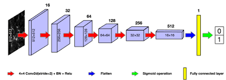

(Srivastava et al., 2022)

### 2.3.4 k-Nearest Neighbors (k-NN)

# 3. Metodología
## 3.1 Análisis Exploratorio y Preprocesamiento
El procesamiento se estructuró en tres fases principales: (1) análisis exploratorio inicial del dataset, (2) definición del pipeline de preprocesamiento y (3) generación del conjunto de datos normalizado. Todo el procedimiento se llevó a cabo utilizando herramientas de visión por computador, principalmente OpenCV y NumPy, sobre el dataset Chest X-Ray Pneumonia.

### 3.1.1. Análisis exploratorio de datos
El análisis exploratorio tuvo como objetivo comprender la estructura y las características del dataset antes de aplicar cualquier transformación. En primer lugar, se realizó una visualización de muestras representativas de ambas clases (NORMAL y PNEUMONIA), lo que permitió identificar variaciones en el contraste, la iluminación y la presencia de artefactos. Posteriormente, se evaluó la distribución de clases con el fin de reconocer posibles desbalances que pudieran afectar el rendimiento de futuros modelos de clasificación. Finalmente, se analizó la distribución del tamaño original de las imágenes, observándose una amplia variabilidad entre estudios radiográficos, lo cual justificó la necesidad de normalizar las dimensiones como parte del preprocesamiento.

### 3.1.2. Pipeline de preprocesamiento
Con base en los resultados del análisis exploratorio, se definió un pipeline de preprocesamiento orientado a homogenizar y mejorar las imágenes antes de su uso en etapas posteriores.

### 3.1.2.1 Normalización espacial
Todas las imágenes fueron reescaladas a dimensiones fijas de 256×256 píxeles mediante interpolación bilineal. Este paso permitió estandarizar la resolución de entrada, reducir la variabilidad asociada a distintos equipos radiológicos y facilitar la aplicación de descriptores de textura y modelos de clasificación.

### 3.1.2.2 Normalización e intensificación del contraste
Para mejorar la visibilidad de estructuras anatómicas relevantes y compensar diferencias en iluminación, se aplicó la técnica CLAHE .

### 3.1.2.3 Preparación de estructura de salida
Se creó una estructura de carpetas espejo que replica la organización del dataset original en sus particiones: train, test y val. Esto permitió almacenar de manera ordenada las imágenes resultantes y garantizar trazabilidad entre los conjuntos original y procesado.

### 3.1.3. Generación del dataset preprocesado
Una vez definido el pipeline, se procesaron de forma secuencial todas las imágenes del dataset. Finalmente, la imagen transformada se guardó en el directorio correspondiente según su categoría y partición.

### 3.1.2 Segmentación
Para la segmentación se utilizaron dos metodologías.

#### 3.1.2.1 Segmentacion por Umbralizacion

Este enfoque para la segmentación de imágenes médicas, consiste en combinar técnicas de suavizado, umbralización y morfología matemática para obtener máscaras que enfoquen la región de interés. 
El suavizado aplicado mediante un gaussian blur (G) reduce el ruido aplicando un kernel definido por la ecuación:

$$
G(x,y) = (1 / (2πσ²)) * exp(-(x² + y²) / (2σ²))
$$

Lo que mejora la definición de las regiones que se desean separar para su posterior procesamiento, después, se aplica la umbralización automática de Otsu determina un umbral T que maximiza la varianza entre clases. La función objetivo es:

$$
σ_b²(T) = ω₀(T) * ω₁(T) * ( μ₀(T) − μ₁(T) )²
$$

En donde ω₀ y ω₁ son las probabilidades de cada clase y μ₀, μ₁ sus medias respectivas, y el resultado $$σ_b²(T)$$ es la varianza entre clases (between-class variance) que utiliza el método de Otsu para evaluar qué tan bien un umbral T separa dos grupos de píxeles.

Con ese umbral se genera una máscara binaria definida como:

$$
M(x,y) = 1 si I(x,y) ≥ T ; 0 si I(x,y) < T.
$$

Si la media de intensidades de la región blanca resulta menor que la de la región negra, la máscara se invierte para asegurar que la zona de interés quede destacada.

Finalmente, la máscara se aplica a la imagen original mediante: $$Iseg(x,y) = I(x,y) * M(x,y)$$, y el resultado se normaliza usando, $$Inorm = 255 * (Iseg − Imin) / (Imax − Imin)$$, lo que asegura que la región segmentada quede dentro de un rango uniforme de intensidades, facilitando su análisis posterior.

#### 3.1.2.2 Segmentación automática de los pulmones mediante un modelo PSPNet
Para segmentar los pulmones, se utilizó un modelo PSPNet preentrenado en el conjunto ChestX-Det, disponible en la librería TorchXRayVision. Este modelo se seleccionó debido a su capacidad para detectar estructuras anatómicas en radiografías de tórax con alta precisión. El modelo produce mapas de probabilidad para diversas estructuras, entre ellas Left Lung y Right Lung, que se integran para obtener una máscara pulmonar final.

Cada imagen radiográfica se sometió a los siguientes pasos:

Lectura de la imagen (RGB o escala de grises).
Normalización del rango dinámico a [-1024, 1024], siguiendo el estándar de TorchXRayVision.
Conversión a un solo canal en caso de imágenes RGB, mediante promediado.

Aplicación de transformaciones estándar:
XRayCenterCrop: centrado anatómico,
XRayResizer: ajuste a 512×512 píxeles.

Se seleccionaron los canales correspondientes a Left Lung y Right Lung, y se aplicó una función sigmoide para obtener probabilidades por píxel. Finalmente, la máscara pulmonar binaria se generó mediante umbralización (thresh = 0.5). El proceso se automatizó para todo el dataset, creando una estructura de carpetas espejo para almacenar las máscaras generadas según conjunto (train, val, test) y clase (NORMAL, PNEUMONIA). Cada imagen segmentada se almacenó como un archivo independiente en formato JPEG.

Una vez generadas las máscaras, se procedió a recortar las imágenes originales para conservar únicamente la región pulmonar, lo cual mejora el desempeño de descriptores como textura, forma o frecuencia.

Aplicación de la máscara mediante operación bitwise AND:

lung_only = cv2.bitwise_and(img_resized, img_resized, mask=mask)

Esta operación conserva exclusivamente los píxeles correspondientes a los pulmones y elimina el resto de la estructura torácica (costillas, diafragma, tejidos blandos no relevantes).Cada imagen recortada se almacenó en una nueva estructura de carpetas espejo, destinada a contener el dataset final segmentado.

## 3.2 Extracción de Descriptores Clásicos
### 3.2.1 Descriptores de Forma

#### 3.2.1.1 Descriptores de contorno

#### 3.2.1.2 Fourier Shape Descriptors 

La función fourier_descriptors extrae descriptores de forma de Fourier de un contorno binario de manera sistemática.

Primero, la máscara de entrada se convierte en binaria, donde el fondo es 0 y el objeto es 255, asegurando que los contornos se detecten correctamente. A continuación, se identifican todos los contornos en la máscara y se selecciona el contorno con mayor área, que representa el objeto principal.

Cada punto del contorno $$(xk, yk)$$ se transforma en un número complejo $$zk = xk + i*yk$$, lo que permite manejar conjuntamente las coordenadas x e y. 
Luego, se centra el contorno en el origen restando la media de todos los puntos:

$$
zk ← zk - (1/N) * sum{k=0}^{N-1} zk
$$

Eliminando así la dependencia de la posición dentro de la imagen. Se aplica la transformada discreta de Fourier $$Zn = sum{k=0}^{N-1} zk * exp(-i * 2 * pi * n * k / N)$$, que descompone el contorno en diferentes **“frecuencias de forma”**.

Se seleccionan los primeros n descriptores, coeficientes de baja frecuencia (excluyendo el término DC) y se normalizan por la magnitud del primer coeficiente $$Zn ← Zn / |Z1|$$.
Dependiendo de la opción, se puede usar solo la magnitud features = |Zn| para que los descriptores sean invariantes a la rotación, o conservar la fase features = [Re(Zn), Im(Zn)] para mantener información de orientación.

El resultado es un vector compacto que representa la forma del objeto, que utilizaremos para comparar y clasificar contornos en análisis de imágenes médicas, evaluando los posibles cambios que puedan surgir en radiografías futuras.

#### 3.2.1.3  Momentos de Hu
La extracción de Momentos de Hu se realizó a partir de las máscaras pulmonares segmentadas previamente. Cada máscara fue leída en escala de grises y convertida a formato binario mediante un umbral fijo, garantizando una delimitación consistente de la región pulmonar. A partir de esta máscara binaria, se calcularon los momentos espaciales y centrales utilizando cv2.moments(), y posteriormente se obtuvieron los siete Momentos de Hu mediante cv2.HuMoments(). Para mejorar su estabilidad numérica y reducir su rango dinámico, se aplicó la transformación logarítmica estándar a cada descriptor. Finalmente, los vectores de características generados para cada imagen se organizaron por partición del dataset (train, val, test) y se almacenaron en archivos .npz, junto con sus etiquetas y nombres de archivo, permitiendo su uso directo en etapas posteriores de clasificación o análisis morfológico.

### 3.2.2 Descriptores de Textura

#### 3.2.2.1 Local Binary Patterns (LBP)
Para la caracterización de la textura presente en las radiografías de tórax, uno de los descriptores a probar fueron los Local Binary Patterns (LBP), usados ampliamente en análisis de imágenes médicas por su eficiencia en terminos de iluminación y capacidad para representar texturas relevantes. 

#### 3.2.2.2 Gray Level Co-ocurrence Matrix (GLCM)
El procedimiento implementado realiza la extracción de características de textura a partir de imágenes médicas utilizando la Matriz de Co-ocurrencia de Niveles de Gris (GLCM), para luego generar un dataset listo para clasificación. Primero, cada imagen se convierte a escala de grises y se redimensiona a 256×256 píxeles. Los niveles de gris se reducen a un número fijo L = 16. Esto se hace dividiendo cada valor de píxel por 16 y tomando la parte entera:

$$
I_{\text{norm}} = \left\lfloor \frac{I}{256 / L} \right\rfloor
$$

Esto normaliza la intensidad de la imagen y reduce el rango de valores para facilitar el cálculo de la GLCM.
Para cada distancia d ∈ {1, 2, 4} y cada ángulo θ ∈ {0, π/2, π/4, 3π/4}, se calcula la matriz de co-ocurrencia de niveles de gris, normalizada y simétrica. Cada elemento de la matriz representa la probabilidad de que un píxel con un nivel de gris específico aparezca junto a otro píxel a esa distancia y ángulo dados:

$$
\text{GLCM}_{d,\theta}[i,j] =
P\left( I_{\text{norm}}(x, y) = i, I_{\text{norm}}(x', y') = j \right)
$$

Donde (x', y') es el píxel vecino a distancia d en la dirección θ.

A partir de cada GLCM se calculan cuatro propiedades de textura:

Contraste: 

$$
\text{Contraste} = 
\sum_{i}\sum_{j} (i - j)^{2}\, \text{GLCM}[i,j]
$$

Correlación: 

$$
\text{Correlacion} =
\frac{
\sum_{i}\sum_{j} (i - \mu_i)(j - \mu_j)\,\text{GLCM}[i,j]
}{
\sigma_i \,\sigma_j
}
$$

Energía:

$$
\text{Energia} = \sum_{i}\sum_{j} (\text{GLCM}[i,j])^{2}
$$

Homogeneidad:

 $$
\text{Homogeneidad} = \sum_{i}\sum_{j} \frac{\text{GLCM}[i,j]}{1 + |i - j|}
$$

Estas características se calculan para cada combinación de distancia y ángulo, generando un vector de características que representa la textura de cada imagen.

#### 3.2.2.3 Filtros de Gabor
La extracción de descriptores de textura mediante filtros de Gabor se realizó utilizando un banco de filtros multi–escala y multi–orientación aplicado sobre las imágenes pulmonares previamente recortadas. En primer lugar, se definió un conjunto de kernels Gabor utilizando tres longitudes de onda (λ = 4, 8 y 16 píxeles) y cuatro orientaciones uniformemente distribuidas entre 0 y π radianes. Cada kernel se generó mediante la función cv2.getGaborKernel(), empleando valores típicos para los parámetros de la envolvente gaussiana, como sigma = 0.56·λ, gamma = 0.5 y fase psi = 0. Esto permitió crear un banco total de 12 filtros sensibles a distintas frecuencias espaciales y direcciones predominantes de textura.

Para cada imagen en escala de grises, se aplicó cada filtro mediante convolución bidimensional (cv2.filter2D()), obteniendo una respuesta filtrada por combinación de escala y orientación. Con el fin de construir un descriptor compacto y robusto, se extrajeron dos estadísticas por cada respuesta: el valor medio y la desviación estándar. Estos valores se concatenaron para formar un vector final de 48 características por imagen. Posteriormente, dichos vectores se almacenaron en archivos .npz separados para cada partición del dataset (train, val y test), junto con sus respectivas etiquetas y rutas de archivo

## 3.3 Clasificación con Descriptores Clásicos
### 3.3.1 SVC: Support Vector Machine

La metodología aplicada en el def pipeline para procesar los descriptores, consiste en integrar descriptores de forma y textura provenientes de archivos NPZ, normalizarlos, reducir su dimensionalidad y finalmente clasificarlos mediante un modelo SVM utilizando distintos kernels en este caso: rbf, linear y poly.

Primero se cargan los descriptores: **X_form** y **X_texture**, los cuales representan características geométricas y características basadas en intensidad, respectivamente. Ambos vectores se concatenan para formar un único conjunto de atributos:

$$
X = [X_form | X_texture]
$$

Luego, los datos se normalizan mediante StandardScaler, que transforma cada característica usando:

$$
X_norm = (X − μ) / σ
$$

Con el objetivo de que todas las variables tengan una media 0 y desviación estándar 1.

Si la opción está activa, se aplica PCA manteniendo el 95% de la varianza. La reducción de dimensionalidad se logra proyectando los datos en nuevos componentes principales definidos por la descomposición en valores propios de la matriz de covarianza. Este proceso genera un espacio donde se preserva la mayor parte de la información relevante. La etapa de clasificación utiliza un SVM (Support Vector Machine), cuya función objetivo es maximizar el margen entre clases. Su forma general es buscar un hiperplano:

$$
f(x) = w · x + b
$$

Que separe correctamente los datos, o bien, mediante un kernel, transformarlos a un espacio donde la separación sea posible. Los kernels usados fueron:

**Linear: separación por hiperplano directo.**

**RBF: utiliza $$K(xᵢ, xⱼ) = exp(−γ ||xᵢ − xⱼ||²)$$, permitiendo fronteras no lineales.**

**Poly: $$K(xᵢ, xⱼ) = (γ xᵢ·xⱼ + r)^d$$, que modela relaciones polinomiales.**

La evaluación se realiza mediante validación cruzada de 5 particiones, asegurando que cada fold mantiene la proporción de clases. En cada partición se obtienen predicciones y probabilidades (para la curva ROC). Con ellas se calculan las métricas:

$$
Accuracy = (TP + TN) / Total
$$

$$
Precision = TP / (TP + FP)
$$

$$
Recall = TP / (TP + FN)
$$

$$
F1 = 2 * (Precisión * Recall) / (Precision + Recall)
$$

También se genera la matriz de confusión, para visualizar errores entre clases, y la curva ROC, cuya área bajo la curva (AUC) mide la capacidad discriminativa del modelo.
Finalmente, el pipeline devuelve las variables principales del proceso: datos combinados, datos finales tras normalización y PCA, predicciones, métricas y matriz de confusión, permitiendo comparar el rendimiento de cada kernel de manera consistente y reproducible.

### 3.3.2 Random Forest
El modelo fue construido a partir de las matrices de características generadas previamente (Hu, Gabor, Fourier, GLCM, LBP y contornos). En primer lugar, se cargaron los conjuntos train, val y test, combinando los descriptores seleccionados según cada experimento. Para mejorar la comparabilidad entre características heterogéneas, todos los vectores fueron normalizados mediante MinMaxScaler, garantizando que cada variable se encontrara entre 0 y 1.

Posteriormente, se aplicó una reducción de dimensionalidad mediante SelectKBest con el estadístico ANOVA (f-classif), permitiendo conservar únicamente las características más relevantes para la discriminación entre clases. Con el conjunto reducido, se unieron los subconjuntos de entrenamiento y validación para conformar un bloque de entrenamiento robusto. Sobre este conjunto se entrenó un Balanced Random Forest, que incorpora balanceo interno para mitigar el desbalance entre clases, utilizando 400 árboles, profundidad máxima de 18 y criterios de división ajustados para evitar sobreajuste.

El desempeño del modelo se evaluó mediante validación cruzada estratificada de 10 particiones, registrando métricas estándar como accuracy, precisión, sensibilidad, F1-score y AUC. Luego, el modelo final se entrenó con todos los datos de entrenamiento y validación combinados, y se evaluó sobre el conjunto test independiente. Finalmente, se generaron la matriz de confusión, curvas ROC y el análisis de importancia de características, permitiendo interpretar el aporte relativo de cada descriptor en la clasificación.

# 4. Resultados y Análisis

## 4.1 Análisis Exploratorio y Preprocesamiento

Primero se realizón la observación del dataset:

  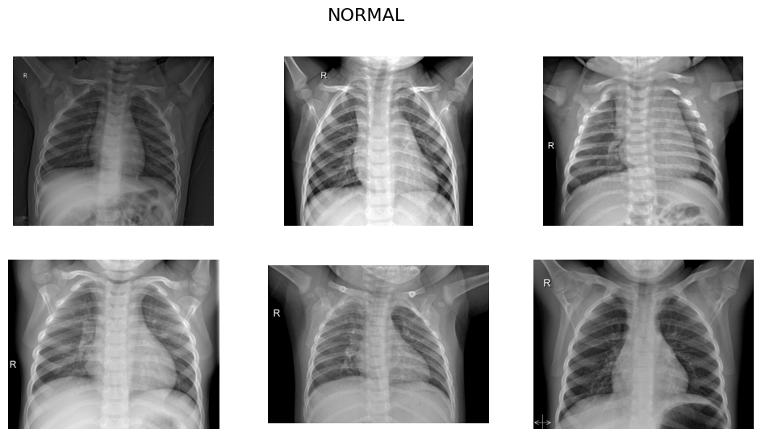
  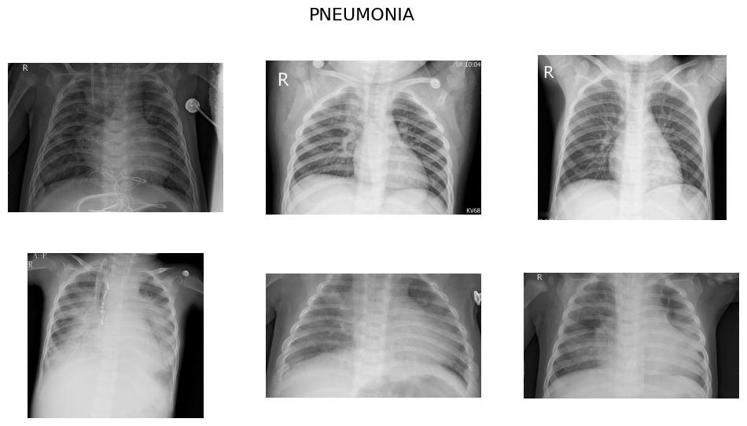

Las imágenes del dataset presentan variabilidad en contraste, resolución y condiciones clínicas. El conjunto incluye casos NORMAL, donde la anatomía pulmonar se observa sin alteraciones, y casos PNEUMONIA, caracterizados por opacidades pulmonares, consolidaciones y patrones compatibles con infección.

Luego, La distribución de clases

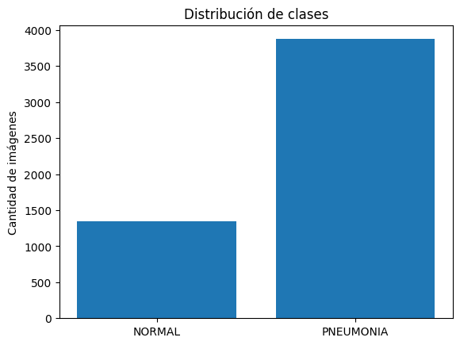

Donde puede observarse que para el entrenamiento el conjunto de datos está bastante desbalanceado con un R=2.89, lo que implica que por cada imagen NORMAL hay aproximadamente 2.9 imágenes con PNEUMONIA. 

Posteriormente, se analizó la distribución de tamaños del dataset. 

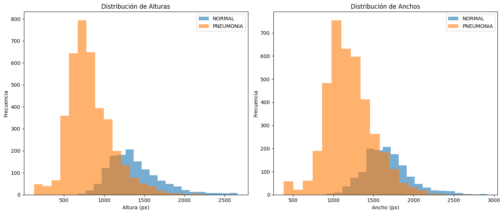

Existe una gran variabilidad en estos, por lo que se considera reescalar todas las imágenes a 256 x 256 conservando la información clínica. 

De esta manera, se inicia con el pipeline de preprocesamiento. primero el reescalado y luego la aplicación del CLAHE.

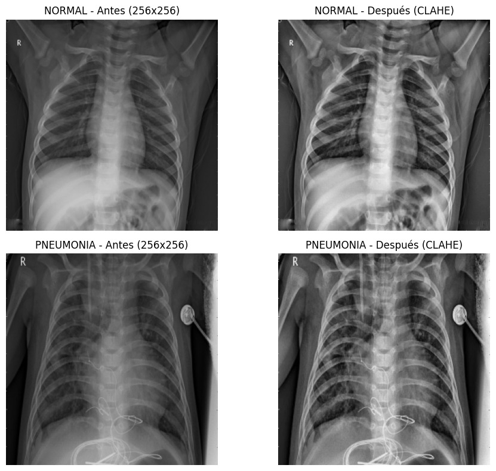

Se observa una mejora en la visibilidad de estructuras anatómicas y en el contraste.

Finalmente, se realizó la segmentación por ambos métodos y se creó el dataset del corte.

  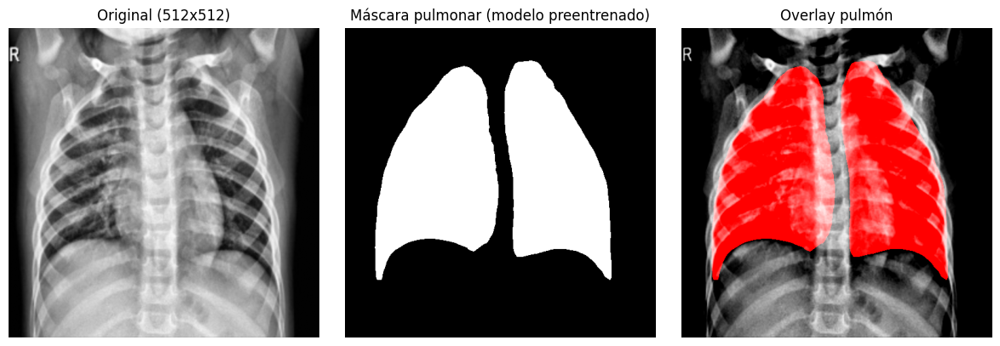
  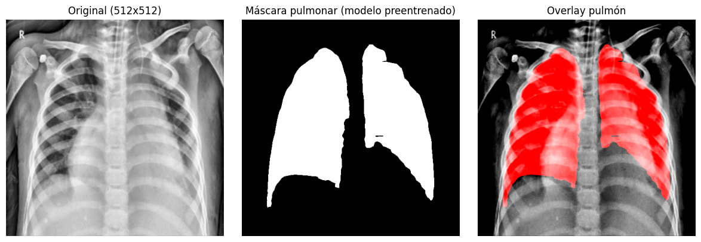

Puede observarse que el modelo PsNet logra una segmentación superior; por ello, se seleccionaron estas imágenes para la extracción de descriptores y el entrenamiento de los clasificadores.

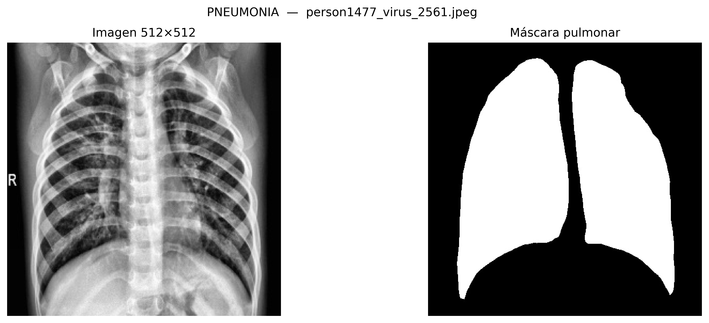

## 4.1.2 Segmentacion por Umbralizacion

La umbralizacion fue finalmente implementada de acuerdo a las formulas de la metodologia, veremos como las partes no necesarias oscurecidas por recuadros negros.

A pesar de esto nos decantamos finalmente por elegir otro tipo de segmentacion, si bien la segmentacion por umbralizacion funcionaba la mayoria de los casos, notamos como en 1 de cada 10 ocasiones se presentaban huecos en la segmentacion o diractamente oscurecian la mayor parte de la imaghen, que se implementaban de manera extraña y obstruian el resultado final, aqui podemos ver un ejemplo de ello.

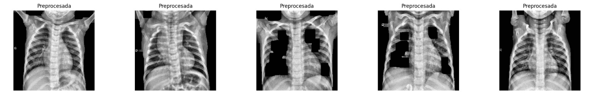

## 4.2 Extracción de Descriptores Clásicos
### 4.2.1 Descriptores de Forma

#### 4.2.1.1 Descriptores de contorno

#### 4.2.1.2 Fourier Shape Descriptors 

El descriptor de Fourier calculado representa la forma del objeto en la máscara binaria de manera compacta e invariante a rotación y traslación. 

Los primeros coeficientes (de baja frecuencia) capturan la estructura general del contorno, mientras que los coeficientes más pequeños (de alta frecuencia) reflejan los detalles finos o irregularidades. 

Al normalizar por el primer coeficiente, se elimina la escala, y al usar solo magnitudes, se asegura que la representación no dependa de la orientación del objeto. Así, el vector resultante de 20 valores resume de manera eficiente la geometría del contorno para análisis o clasificación de formas.

$$
FSD: [1, 0.20798111, 0.16755065, 0.12457743, 0.07452007, 0.0438846, 0.02566708, 0.01921481, 0.01981973, 0.0112455 , 0.00689003, 0.00988536, 0.00642878, 0.00976752, 0.00664809, 0.00710578, 0.00352025, 0.00157852, 0.00208309, 0.00229794]
$$

El vector de 20 coeficientes muestra que la forma del contorno está principalmente definida por características de baja frecuencia, capturando la estructura general del objeto.

El primer valor, normalizado a 1, indica la escala de referencia, mientras que los coeficientes siguientes disminuyen rápidamente, lo que refleja que las frecuencias más altas aportan menos a la forma global. 
Los valores pequeños hacia el final representan detalles finos y rugosidades del contorno, mostrando que la geometría general domina la representación y sólo los últimos coeficientes codifican irregularidades menores.

Hay una forma en la cual es posible visualizar las formas que se crean con los datos de fourier, si bien esto finalmente tiene un menor impacto ya que, lo importante son los datos extraidos para su procesamiento posterior esta visualizacion nos da una idea de las formas que se crean a partir de las imagenes originales.

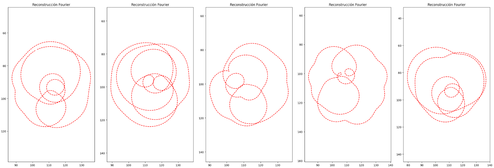

#### 4.2.1.3 Momentos Hu
Para los momentos de Hu se utilizaron las máscaras pulmonares, se obtiene como ejemplo:

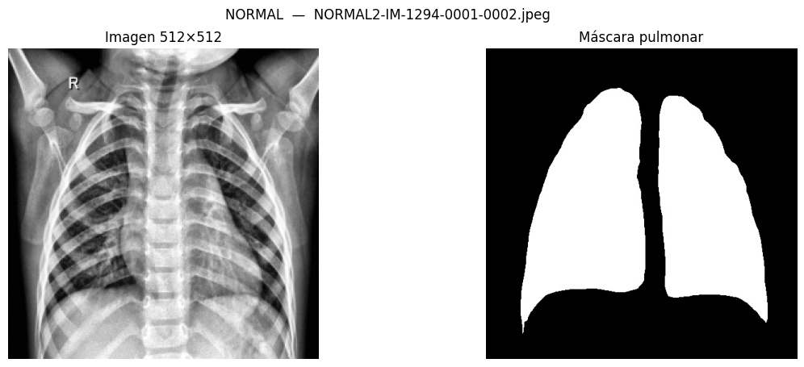

$$
\text{Hu}_{\text{log}}(\text{NORMAL}) =
[\, 3.09518535,\; 7.74283017,\; 9.91124263,\; 11.36732456,\; -12,\; -11.99984012,\; -12 \,]
$$

$$
Hu_{log}(PNEUMONIA) =
[ 3.09793794,\; 8.06061368,\; 9.94164528,\; 11.05105342,\; -12,\; -11.99971903,\; -12 ]
$$

Posteriormente se guardan todos los momentos para train/test/val.

#### 4.2.1.4 Histogram of Oriented Gradients (HOG)
Primero se obtuvieron los descriptores con las imágenes completas y se observó que algunas características, como el texto en las imágenes, generaban descriptores fuertes. 

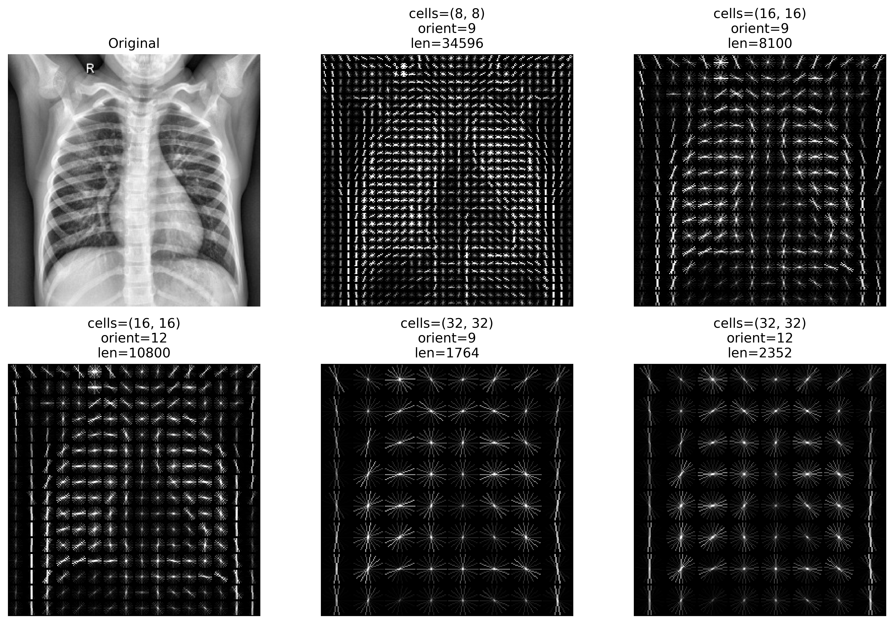

Por tal motivo, se realizó de nuevo utilizando la zona específica de los pulmones.

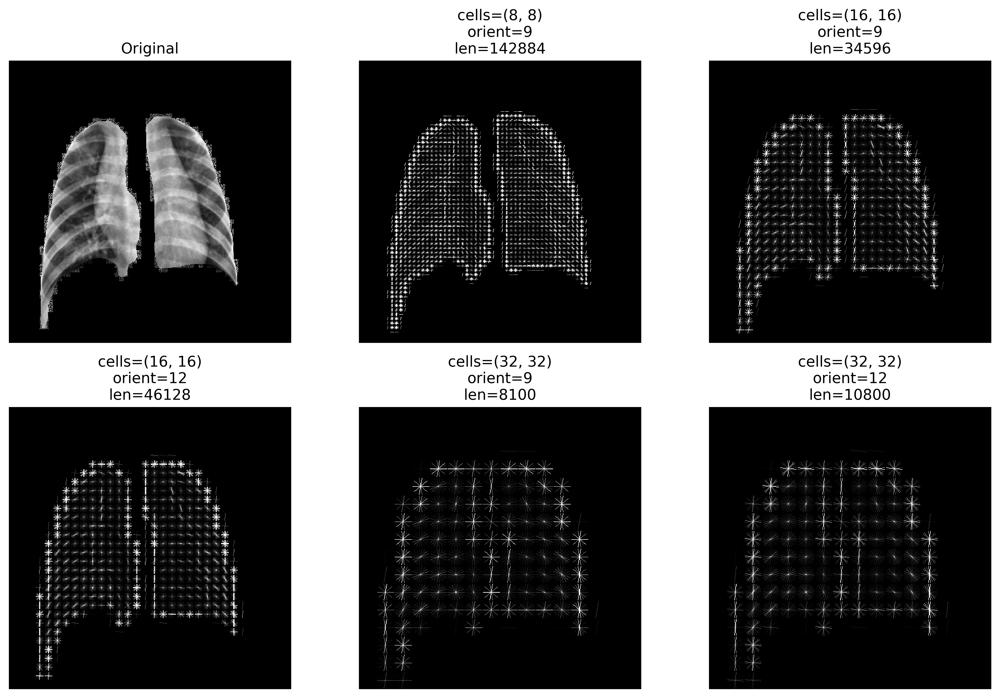

Posteriormente, se obtuvo el descriptor para ambas clases considerando los mejores paámetros: 

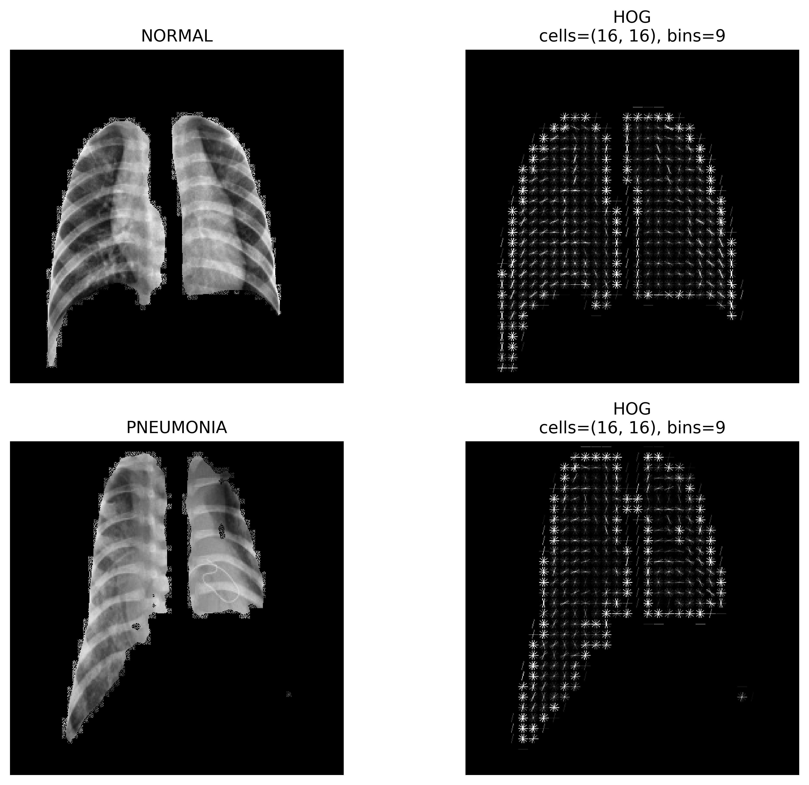

Finalmente, se guardan para train/test/val.

### 4.2.2 Descriptores de Textura

#### 4.2.2.1 Local Binary Patterns (LBP)
 
#### 4.2.2.2 Gray Level Co-ocurrence Matrix (GLCM)

En las cinco imágenes analizadas de pulmones normales, los valores de correlación permanecen altos (entre 0.91 y 0.98 en la mayoría de los casos), lo cual indica una fuerte relación lineal entre los pares de píxeles. Por lo que podemos intuir que esto es típico en regiones pulmonares sanas por lo menos detectadas con GLMC, donde la distribución de intensidades cambia suavemente y no existen patrones abruptos.
El contraste, que mide la variación local, se mantiene mayormente bajo en las primeras mediciones (≈ 0.8 a 2.5) y solo aumenta en las últimas filas (≈ 4 a 7). La energía, asociada al orden y repetición de patrones, se encuentra en rangos moderados a altos (≈ 0.58 a 0.74) y parece mantenerse estable durante las 5 imágenes. La homogeneidad, que evalúa qué tan uniforme es la matriz de coocurrencias, también se mantiene elevada (≈ 0.82 a 0.91 en la mayoría de los desplazamientos). Estos comportamientos podrían intuir la presencia de un pulmón sano ya que no difieren tanto como lo veremos en las de neumonía.

En conjunto, los cinco casos presentan un patrón muy similar: alta correlación, homogeneidad elevada, energía moderada-alta y contraste bajo en los primeros desplazamientos y mayor en los últimos.

Los valores obtenidos a partir de los descriptores GLCM para las 5 imágenes con neumonía muestran unos resultados más irregulares en comparación con las imágenes de pulmones normales. En la mayoría de las muestras, los valores de contraste son más elevados y varían en rangos amplios. 

Mientras que las primeras filas muestran contrastes relativamente bajos (≈ 0.5 a 2), las últimas mediciones aumentan notablemente (≈ 3 a 9). Podemos concluir que esto se debe a los posibles cambios en las texturas que puedan presentar los pulmones debido a la gravedad de la enfermedad.

La correlación, aunque aún presenta valores relativamente altos en algunos desplazamientos (≈ 0.94 a 0.98), disminuye más frecuentemente que en los casos normales, llegando incluso a valores alrededor de 0.78 a 0.84 en las filas donde el contraste es mayor. Esta reducción indica que los pares de píxeles presentan menor relación lineal, En cuanto a la energía, los valores promedio (≈ 0.52 a 0.63) son consistentemente más bajos que los observados en pulmones normales. La homogeneidad también presenta valores reducidos, especialmente en los últimos desplazamientos, donde oscila entre 0.70 y 0.80. En imágenes normales, la homogeneidad típica supera el 0.85–0.90.

En conjunto, las imágenes con neumonía muestran un patrón claro: contraste más alto, correlación más variable, energía más baja y homogeneidad reducida.

Podemos entonces concluir que los pulmones normales plantean valores más consistentes aunque no iguales entre sí, pero cuando pasamos a hablar de una neumonía que puede tener distintas causas y posibles afectaciones dependiendo de la persona, veremos cómo ciertos valores son más erráticos entre las distintas imágenes de las 5 muestras. 

| Descriptor   | Imagen Normal | Imagen con Neumonía |
|--------------|---------------|---------------------|
| Contraste    | ~4.12         | ~7.62               |
| Correlación  | ~0.81         | ~0.82               |
| Energía      | ~0.71         | ~0.50               |
| Homogeneidad | ~0.82         | ~0.70               |

#### 4.2.2.3 Filtros de Gabor
El banco de filtros Gabor utilizado estuvo compuesto por 12 kernels generados mediante la combinación de tres longitudes de onda (λ = 4, 8 y 16) y cuatro orientaciones (θ = 0°, 45°, 90° y 135°), con un tamaño fijo de 31×31 píxeles. Para cada combinación de parámetros, se construyó un kernel conforme a la función Gabor clásica, los parámetros sigma = 0.56·λ, gamma = 0.5 y psi = 0 se mantuvieron constantes para asegurar una respuesta estable entre escalas. Este banco de filtros permitió capturar información textural a múltiples escalas y orientaciones, produciendo un total de 48 características por imagen (media y desviación estándar de cada respuesta filtrada).

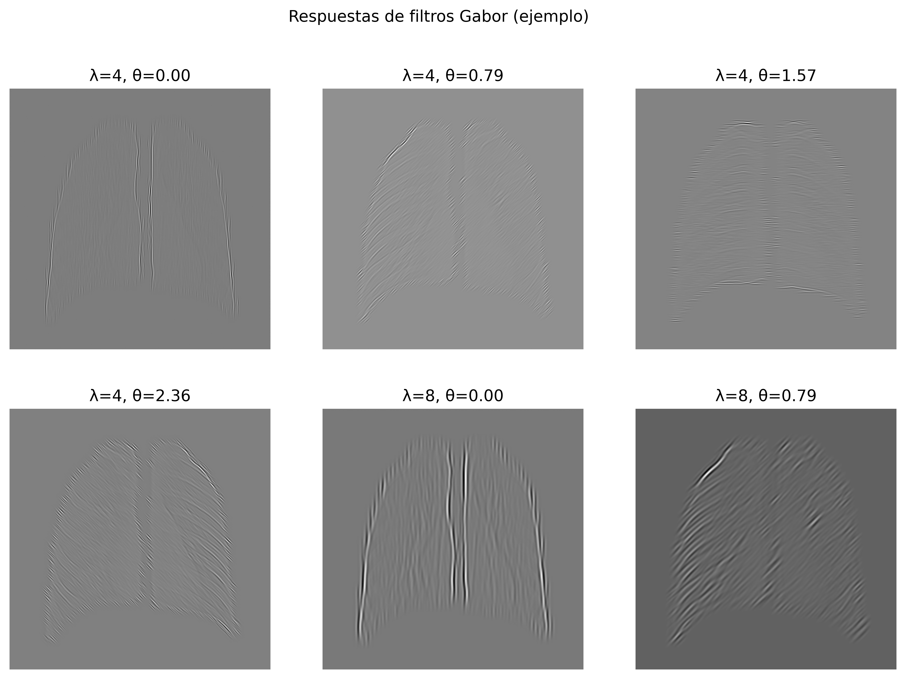

Finalmente, se guardan los descriptores para todo el dataset.

## 4.3 Clasificación con Descriptores Clásicos

### 4.3.1 SVC: Support Vector Machine

### 4.3.2 Random Forest
Se utilizó Balanced Random Forest, una variante del algoritmo Random Forest diseñada para manejar desbalances entre clases mediante remuestreo interno. El modelo final empleado en cada experimento se definió con los siguientes parámetros:

BalancedRandomForestClassifier
**n_estimators = 400**
 Número total de árboles en el bosque. Un número elevado reduce la varianza y aumenta la estabilidad del modelo.
**class_weight = "balanced"**
 Ajusta el peso de cada clase de forma inversamente proporcional a su frecuencia, mitigando el desequilibrio NORMAL–PNEUMONIA.
**max_depth = 18**
 Limita la profundidad de los árboles para evitar sobreajuste manteniendo capacidad de modelado.
**min_samples_split = 4**
 Número mínimo de muestras para dividir un nodo.
**min_samples_leaf = 2**
 Número mínimo de muestras en un nodo.
**random_state = 42**
 Garantiza reproducibilidad.
**n_jobs = -1**
 Utiliza todos los núcleos disponibles para acelerar el entrenamiento.

Adicionalmente, se utilizaron:
Normalización: MinMaxScaler()
 Escala cada característica al rango [0, 1], evitando que descriptores de distinta magnitud dominen el clasificador.

Se usó SelectKBest(f_classif) con distintos valores de k según la combinación de descriptores:
| **Combinación**     | **k seleccionado** |
|----------------------|--------------------|
| Hu + Gabor           | k = 30             |
| Fourier + GLCM       | k = 60             |
| Contorno + LBP       | k = 50             |

Validación cruzada: StratifiedKFold(n_splits=10, shuffle=True)
Garantiza una evaluación robusta con estratificación por clase.

Se obtienen las siguientes métricas:

| Combinación      | Clase | Precision | Recall | F1-score | Support |
|------------------|-------|-----------|--------|----------|---------|
| **Hu + Gabor**   | 0 (NORMAL)   | 0.814 | 0.299 | 0.438 | 234 |
|                  | 1 (PNEUMONIA)| 0.695 | 0.959 | 0.806 | 390 |
| **Fourier + GLCM** | 0 (NORMAL) | 0.804 | 0.474 | 0.597 | 234 |
|                  | 1 (PNEUMONIA)| 0.747 | 0.931 | 0.829 | 390 |
| **Contorno + LBP** | 0 (NORMAL) | 0.688 | 0.376 | 0.486 | 234 |
|                  | 1 (PNEUMONIA)| 0.706 | 0.897 | 0.790 | 390 |

El mejor comportamiento corresponde a Fourier + GLCM, que logra el equilibrio más adecuado entre sensibilidad y especificidad. Hu+Gabor resulta ideal para maximizar la detección de neumonía, pero genera más falsos positivos. Contorno+LBP aporta información limitada y es menos efectivo como descriptor principal. Se muestra mejor en la matriz de confusión:

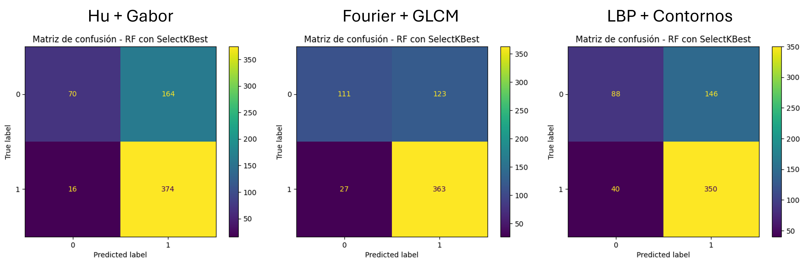

Fourier + GLCM ofrece el mejor equilibrio entre sensibilidad y especificidad.  Hu + Gabor maximiza la detección de neumonía pero penaliza la clase normal.  Contorno + LBP muestra el rendimiento más bajo, especialmente en la correcta identificación de casos normales.

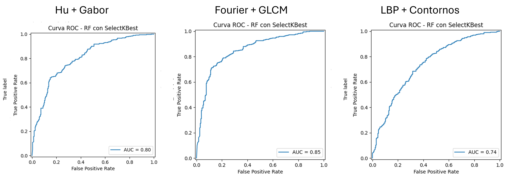

Por otro lado, las curvas ROC obtenidas muestran diferencias importantes en la capacidad discriminativa de cada conjunto de descriptores evaluado. El valor AUC resume esta capacidad global del modelo para separar las clases NORMAL y PNEUMONIA.Fourier + GLCM obtiene el mejor desempeño global (AUC = 0.85) y es la combinación más eficaz para discriminar entre NORMAL y PNEUMONIA. Hu + Gabor alcanza un AUC intermedio (0.80), destacando por su alta sensibilidad. Contorno + LBP presenta la menor capacidad discriminativa (AUC = 0.74).

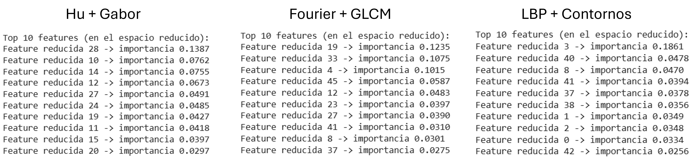

Finalmente, en el Top 10 de descriptores Fourier + GLCM presenta la distribución más equilibrada y estructurada de características importantes, lo que respalda su buen desempeño. Hu + Gabor utiliza múltiples patrones texturales, lo que explica su alta sensibilidad. Contorno + LBP depende excesivamente de una sola característica dominante, indicando menor riqueza descriptiva y menor capacidad de generalización. 

 
 
 
 
 

# 5. Referencias Bibliográficas
Hu, M.-K. (1962). “Visual pattern recognition by moment invariants.” IRE Transactions on Information Theory, 8(2), 179–187. https://doi.org/10.1109/TIT.1962.1057692

Gonzalez, R. C., & Woods, R. E. (2018). Digital Image Processing (4th ed.). Pearson.

Breiman, L. (2001). Random Forests. Machine Learning, 45(1), 5–32. https://doi.org/10.1023/A:1010933404324

# 6. Reporte de Contribución Individual

