# 1\.Introducción

En el ámbito de la visión por computador, el registro y la fusión de imágenes constituyen procesos esenciales para generar representaciones unificadas de escenas capturadas desde múltiples perspectivas. Este trabajo tiene como objetivo aplicar los principios del registro de imágenes mediante la detección y emparejamiento de características, la estimación de homografías y la aplicación de transformaciones geométricas, con el fin de fusionar tres fotografías de un comedor tomadas desde diferentes ángulos y posiciones. A partir de la imagen fusionada, se realizará una calibración métrica utilizando objetos de referencia con dimensiones para estimar medidas reales de otros elementos de la escena. La ejecución de este ejercicio permitirá analizar cómo la integración de múltiples ángulos o puntos de vista permite obtener una imagen más completa del entorno.

# 2\. Marco teórico

## 2.1. Validación de Imágenes Sintéticas

La validación de algoritmos de registro mediante imágenes sintéticas es utilizada para evaluar el desempeño de métodos de alineación geométrica y comparación de imágenes. Las imágenes sintéticas permiten controlar completamente el contenido visual y las transformaciones aplicadas, lo que facilita la medición directa del error y la precisión del algoritmo. Esta capacidad de control no es posible en imágenes reales, donde la referencia verdadera o *ground truth* suele ser desconocida (Ma, Lukas & Fitzpatrick, 1993).

Para lograr este objetivo, se diseñan imágenes con características definidas (formas geométricas, texturas controladas, gradientes o ruido),  posteriormente se les aplican transformaciones afines conocidas, tales como traslación, rotación y escalamiento. La matriz de transformación utilizada se almacena como matriz real o matriz ground truth, permitiendo comparar directamente la transformación estimada por el algoritmo con la transformación aplicada (Goshtasby, 2005).

Las imágenes sintéticas son especialmente útiles en la validación porque:

*Permiten aislar variables específicas: Es posible estudiar el efecto individual de ruido, variación de contraste, deformaciones geométricas o pérdida de información (Fitzpatrick, West & Maurer, 1998).

*Ofrecen reproducibilidad experimental: La experimentación puede repetirse bajo las mismas condiciones con total precisión, favoreciendo la comparación de algoritmos o configuraciones (Zitová & Flusser, 2003).

*Hacen posible medir error real: Al conocer la transformación aplicada, se puede calcular de forma explícita el error angular, el error de escala, la traslación recuperada y métricas de intensidad como RMSE, NCC o MI, lo cual permite una evaluación objetiva (Maintz & Viergever, 1998).

*Permiten estudiar límites de robustez: Es posible aumentar gradualmente la magnitud de rotación, la cantidad de ruido o la pérdida de características para determinar los rangos en los que el algoritmo mantiene un desempeño adecuado (Oliveira & Tavares, 2014).

## 2.2. Registro de Imágenes

**2.2.1 Detección de Características**

La detección de características constituye el primer paso para el registro de imágenes, cuando buscamos combinar **dos o más imágenes** la forma en la que nos tenemos que guiar es la de buscar características comunes entre los planos.

Las características comunes nos serviran como guia ya que cuando somos capaces de encontrarlas ya tenemos puntos específicos en los cuales nos servirán para alinear la imagen, este proceso puede ser llevado a cabo manualmente, seleccionando uno por uno los puntos que consideremos oportunos, sin embargo lo más normal es hacerlo automáticamente con detectores como **(ORB, AKAZE, Sift)**.

**2.2.2 Estimación de Emparejamiento**

El emparejamiento de características es un proceso en el cual buscamos identificar y relacionar puntos o patrones similares entre dos o más imágenes de una misma escena, estos puntos, llamados características o features, se detectan mediante los algoritmos anteriormente dichos que son capaces de identificar la apariencia de una región de la imagen independientemente a cambios de escala, rotación o iluminación.

Las estrategias de emparejamiento robustas se enfocan en establecer correspondencias precisas entre estos descriptores, incluso en presencia de ruido, oclusiones o variaciones en la perspectiva. Para lograrlo, se aplican métodos como el ratio test o la verificación cruzada, y técnicas de filtrado como **RANSAC**, que descarta emparejamientos incorrectos para evitar matchings erróneos.

**2.2.3 Estimación de la Homografía**

Una homografía es una matriz 3×3 que muestra cómo los puntos de una imagen se proyectan sobre otra imagen, permitiendo alinear, superponer o registrar imágenes que difieren por traslación, rotación, escala o cambio de punto de vista.

Para estimarla, se emplean las técnicas de matching de características emparejadas entre ambas imágenes. Se puede calcular la matriz de homografía utilizando métodos como la transformación lineal directa (DLT). Sin embargo, debido a que algunas correspondencias pueden ser erróneas, se aplican técnicas robustas como **RANSAC**.

**2.2.4 Fusión de Imágenes y Optimización**

Una vez tengamos los puntos y hayamos encontrado la homografía después de haber seleccionado una imagen que permanecerá estática y otra que se moverá, la fusión de imágenes consistirá en registrar ambas imágenes tomando en cuenta su homografía con el fin de lograr una nueva imagen en un nuevo lienzo.

En el caso de este trabajo hemos utilizado un método que detecta las esquinas de las imágenes y aplica la homografía que ya habíamos encontrado, a partir de estos límites se desplaza el nuevo lienzo y se modifica la imagen para lograr una nueva en la que las característica puedan encajar.

Dado que debimos usar 3 imágenes, en este caso se utilizó una **homografía identidad**, es decir una **homografía** que no rota ni se traslada para usar como referencia y el acumulado de las otras homografías, si en nuestro caso tenemos una **imagen 2** que rota respeto a la **imagen 1** y una **imagen 3** que rota respecto a la imagen 2, la homografía de de la **imagen 3** respecto a la **imagen 1** será el producto de las 2 anteriores.

Homografía Identidad \= \[1, 0, 0\] \[0, 1, 0 \] \[1, 0, 0\]

## 2.3. Calibracion y Medicion de Imágenes

Cuando hablamos de medición de imágenes digitales, tenemos que tener en cuenta que estas están conformadas por pixeles y por tanto, poseemos la incertidumbre de a cuanto equivale un pixel en el contexto de la imagen, considerando que las imágenes tienen distintas dimensiones unas de otras, lo que debemos tener en cuenta primero es como mínimo un objeto de referencia del cual conozcamos una medida específica, luego debemos encontrar una forma de medirlo dentro de la imagen de la misma forma y realizar la siguiente fórmula.

px per cm \= distancia px / distancia cm

Una vez ya tengamos un referente podremos simplemente obtener los píxeles de un **punto a** que lleguen a un **punto b** y ser capaces de conocer cuánto equivale eso en cm reales. 

# 3\. Metodología

## 3.1 Validación de Imágenes Sintéticas

Se construyó una imagen sintética que sirve como imagen fija de referencia para el proceso de registro. La imagen se compuso mediante figuras geométricas simples (rectángulos y círculos) distribuidas espacialmente para evitar superposiciones, se le adicionó un gradiente de color junto con ruido aleatorio controlado.

Con esta imagen base se generó un conjunto de imágenes transformadas mediante la aplicación de transformaciones como traslación, rotación y escalamiento, con parámetros conocidos (ground truth).

Para estimar la transformación entre la imagen fija y cada imagen transformada, se utilizó un algoritmo de registro estructurado en las siguientes etapas:

**Detección de características:** Se empleó el método **SIFT** para identificar puntos clave robustos frente a cambios de escala y rotación.

**Emparejamiento:** Los descriptores fueron comparados mediante el **método FLANN** junto con el criterio de **Ratio Test** para descartar correspondencias ambiguas.

**Estimación de la transformación:** Se aplicó **RANSAC** para calcular la matriz afín estimada (**M\_est**) y filtrar los inliers que representan correspondencias válidas.

**Registro:** Se aplicó la matriz estimada para alinear la imagen transformada respecto a la imagen de referencia.

**Evaluación:** La matriz estimada se comparó con la matriz real (**M\_gt**) para obtener métricas geométricas (error angular, error de escala y desplazamientos) y métricas basadas en intensidad (RMSE normalizado, NCC y MI). Estas métricas permiten evaluar tanto la precisión geométrica como la similitud radiométrica tras el registro.

## 3.2 Registro de Imagen

Decidimos usar Orb y Akaze por sus diferentes características, Orb es más rápido y Akaze tiene más capacidades a la hora de detectar profundidad, deseábamos ver cómo estos resultados difieren entre sí.

El proceso comenzó con los detectores, en el caso de AKAZE detectó más puntos de interés que ORB y mucho más dispersos por el espacio, Orb pareció centrarse más en esquinas que Akaze. Una vez realizado el emparejamiento se realizó el proceso, primero entre la imagen 1 y 2 creando una satisfactoriamente y conservando su homografía para realizar el acumulado a la hora de mezclar las 3, se repite el proceso con 2 y 3 y luego se calcula el acumulado.

H1 \= i2 \--\> i1  
H2 \= i3 \--\> i2  
Hacumulado \= i3 \--\> i1 \= H1 \* H2

Una vez calculado este acumulado de las homografías se hace un blend de las tres imágenes que busca poder enlazarlas al completo, en este utilizamos la matriz de traslación con la homografía acumulada para que las imágenes que no corresponden a la identidad se muevan en torno a (0,0)  
Homografía Total \= T \* Hi

T \= \[1, 0, xmin\] \[0, 1,ymin\] \[0, 0, 1\] 

Donde Hi representa las homografías de las imágenes entrantes que se trasladaron respecto a la identidad y T representa la matriz de traslación que encontramos con los límites del mosaico que calculamos respecto a las 3 imágenes.

Este proceso da como resultado una imagen única, escalada y alineada respecto a la primera imagen ya que es la que se decidió como referente.

## 3.3 Calibracion y Medicion de Imágenes

Luego de obtener los resultados con el registro de imágenes, se utilizaron las imágenes generadas tanto por Orb como por Akaze para para probar diferentes métodos de medida, para una de ellas obtuvimos los bordes usando métodos de detección de bordes, en este caso fue exitoso y el proceso fue capaz de detectar los bordes del cuadro.

Se eligió este ya que si bien también se detectaban los bordes de la mesa estos se hacían no como un solo borde si no de manera dispar, una vez segmentado el cuadro completo procedimos a sacar su altura en pixeles dibujando un rectángulo con su área mínima y en base a su altura sacamos las medida.

Para la imagen 2 utilizamos un método más manual, utilizando Image seleccionamos los puntos de ambos extremos del cuadro y dibujamos una línea en el notebook sobre la imagen 2, esta línea fue medida en su diámetro diagonal y luego se realizó la conversión como se explicó en el apartado de marco teórico.

Con la conversión completa utilizamos los métodos de detección de bordes y uno personalizable que permite escribir coordenadas (X, Y) para medir distancias en la imagen.

# 4\. Análisis y Resultados

## 4.1 Validación de Imágenes Sintéticas

Se obtuvo la imagen de referencia:

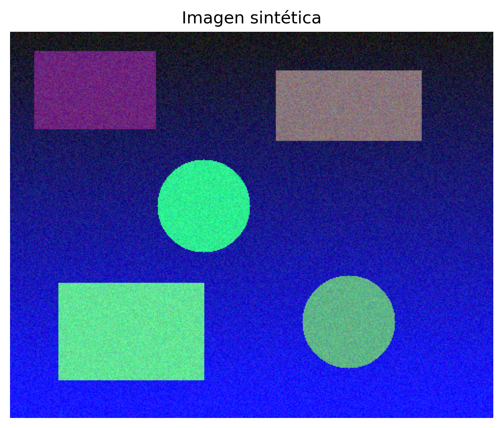 

Después de las transformaciones (Rotación, traslación y escalamiento) se obtuvo el dataset con sus respectivas ground truth.

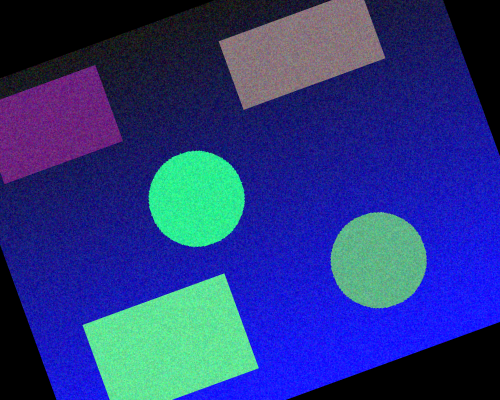 
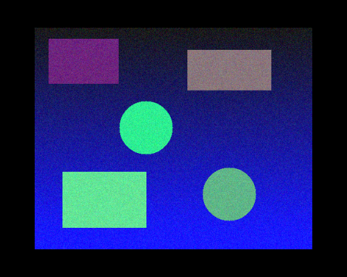
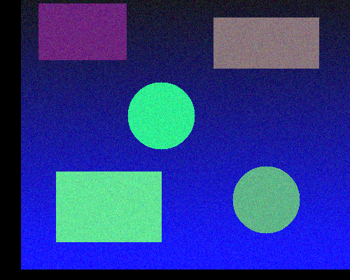

Se aplicó el algoritmo de registro a cada una, obteniendo:

**Rotación:**

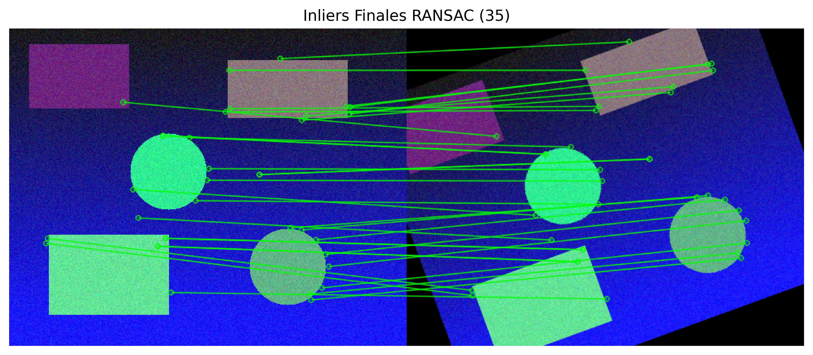
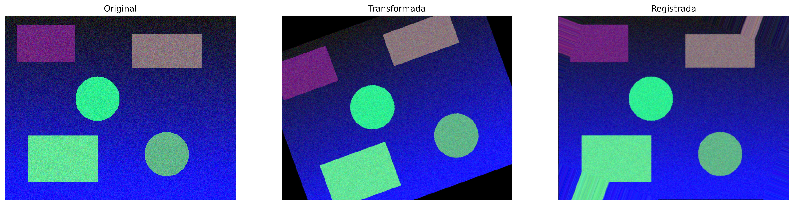

\=== RESULTADOS DE COMPARACIÓN \===  
error\_angular  : 0.002°  
error\_escala   : 0.076%  
error\_tx       : 0.298px  
error\_ty       : 0.042px  
RMSE           : 17.802  
NCC            : 0.938  
MI             : 1.298  
\=====================

Para la rotación, se recuperó la orientación con alta precisión, evidenciada por un error angular mínimo (0.002°). La escala y la traslación estimadas presentaron variaciones muy pequeñas, dentro del rango subpíxel, lo que indica estabilidad del método. Las métricas de similitud muestran una buena correspondencia estructural (NCC \= 0.938, MI \= 1.298), aunque el RMSE elevado se relaciona principalmente con el gradiente y ruido presentes en la imagen y no con un error geométrico.

**Escala:**

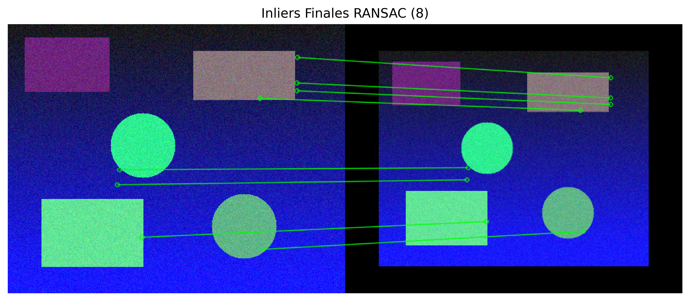
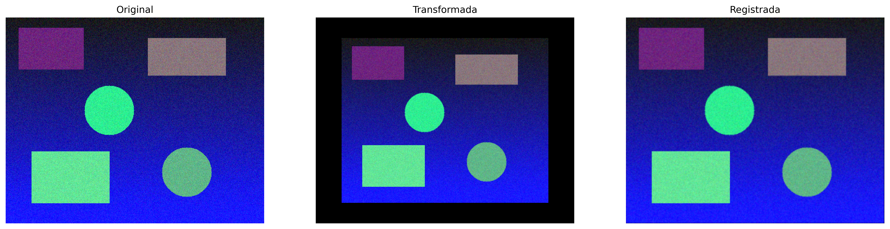

\=== RESULTADOS DE COMPARACIÓN \===  
error\_angular  : 0.003°  
error\_escala   : 0.126%  
error\_tx       : 0.163px  
error\_ty       : 0.273px  
RMSE           : 3.583  
NCC            : 0.997  
MI             : 1.364  
\=====================

En la transformación por escala, la estimación fue altamente precisa, con un error de escala muy bajo (0.126%) y una rotación prácticamente nula. Los errores de traslación se mantuvieron en rango subpíxel, indicando una buena alineación espacial. Las métricas de similitud (NCC \= 0.997 y MI \= 1.364) confirman una alta correspondencia entre las imágenes.

**Traslación:**

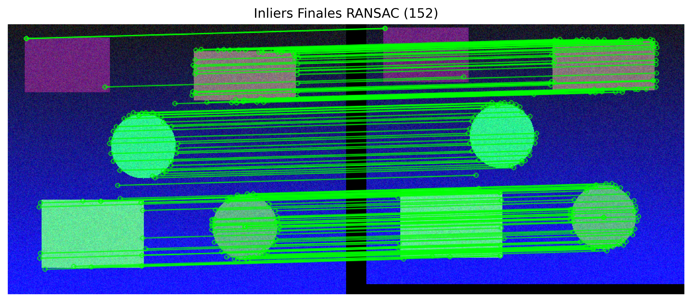
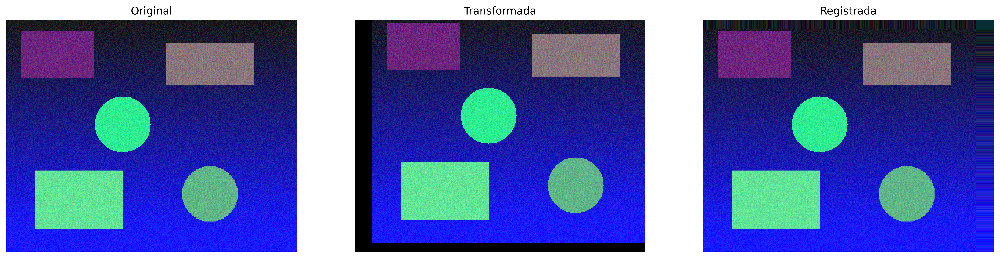

\=== RESULTADOS DE COMPARACIÓN \===  
error\_angular  : 0.004°  
error\_escala   : 0.012%  
error\_tx       : 0.023px  
error\_ty       : 0.005px  
RMSE           : 8.376  
NCC            : 0.986  
MI             : 1.186

El registro para la traslación se estimó correctamente la posición sin introducir rotaciones o deformaciones adicionales, con errores subpíxel en TX y TY y una desviación angular y de escala muy bajas. La alta correlación (NCC \= 0.986) y el valor de MI confirman una buena correspondencia estructural entre las imágenes. El RMSE elevado se atribuye al gradiente y ruido sintético, por lo que no refleja un error geométrico del proceso.  

## 4.2 Registro de Imagen

Tanto ORB como Akaze dieron resultados muy similares, la mayor peculiaridad que se nota a simple vista se ve en la parte superior de Akaze y en los objetos que están más alejados como el cuadro o la línea del techo en este caso para akaze fue mucho más fácil encontrar puntos que para orb, en ambos casos pudimos observar como la imagen 3 al ser combinada se expande para compensar su rotación y es allí donde se ven las mayores imperfecciones.

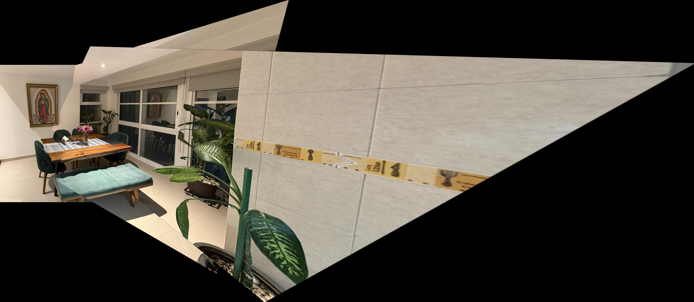

En otro caso, Orb pareció tener mucho más éxito combinando solo dos imágenes que las tres, especialmente en detalles como la mesa se nota que el empalme fue mucho más efectivo. 

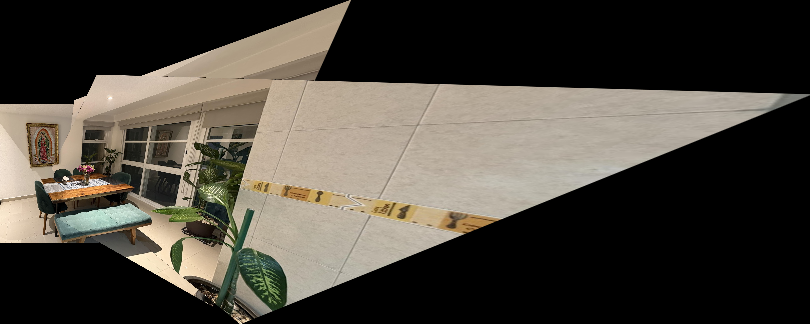

El modelo de imágenes parece tener las mayores discrepancias en puntos donde las tres imágenes se intercalan, especialmente en la silla azul que es uno de los objetos comunes para las tres imágenes.  
Akaze en conclusión tiende a tener un mejor resultado ya que extrae más puntos y por tanto es capaz de enlazar muchos más, Orb sin embargo es más rápido y detalles rectos.

\[ORB\] Características detectadas: 500 en img1, 500 en img2  
\[ORB\] Matches buenos: 99  
\[ORB\] Inliers (RANSAC): 87/99  
\[ORB\] Características detectadas: 500 en img2, 500 en img3  
\[ORB\] Matches buenos: 49  
\[ORB\] Inliers (RANSAC): 39/49  
\[AKAZE\] Características detectadas: 1186 en img1, 1640 en img2  
\[AKAZE\] Matches buenos: 324  
\[AKAZE\] Inliers (RANSAC): 258/324  
\[AKAZE\] Características detectadas: 1186 en img2, 2934 en img3  
\[AKAZE\] Matches buenos: 145  
\[AKAZE\] Inliers (RANSAC): 73/145

Akaze como podemos ver tiene muchos más matches buenos, pero estos se ven reducidos de una manera más drástica cuando los pasamos por el filtro Ransac que con Orb.

## 4.3 Calibracion y Medicion de Imágenes

En la calibracion y medicion encontramos que tanto el método de medir manualmente así como el de segmentar la imagen son efectivos de diferentes formas, segmentar la imagen por un lado permite encontrar diferentes bordes sin necesidad de buscar coordenadas específicas, sin embargo el ruido de la imagen especialmente una imagen combinada genera cortes que hacen el proceso de detección de bordes más complejo, sin embargo en este caso con la segmentación del cuadro se pudo hacer una conversión exitosa de los pixeles a centimetros.

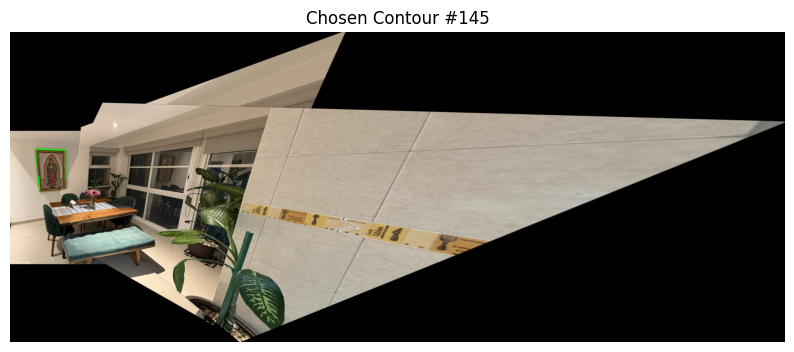

**Calculo realizado con deteccion de bordes del cuadro**

$$
Largo\_Detectado: \ 217.70\ \text{pixeles} = 117.0\ \text{cm}
$$

 $$
Escala:\ k = 1.8607\ \text{px/cm}
$$

Manualmente es más sencillo y más preciso, la única parte compleja se basa en encontrar los dos puntos adecuados.

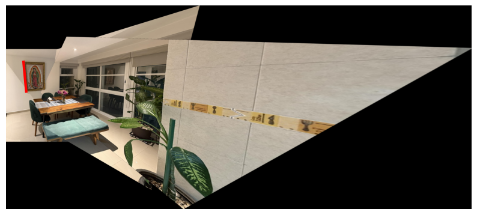

**Calculo realizando al seleccionar 2 puntos en la imagen**

**Distancia entre punto A y punto B: 304.29**

$$
Largo\_detectado:\ 304.29\ px = 117.0\ cm
$$

$$
Escala:\ k = 2.6008\ px/cm
$$

Ambos métodos presentan sin embargo un desfase, ya que estamos hablando de imágenes digitales tenemos el problema que la calidad de la imagen afectará donde comienza un objeto que buscamos medir, siempre habrá un desfase ya que estamos hablando de una representación digital y el margen de error dependerá en gran medida de la calidad tanto de la imagen como de la detección, en el caso del cuadro la detección de bordes lo hará en base a la calidad de la imagen y en el caso manual a la precisión.

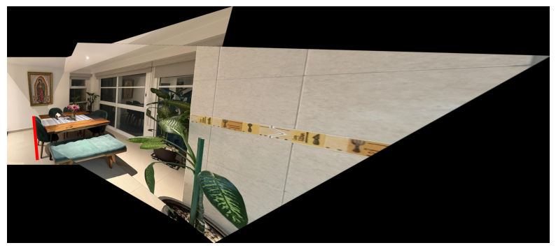

Distancia de la silla en pixeles: 361.33
Alto de la silla: 138.93239357139166 cm

# 5\. Conclusiones

1. La validación con imágenes sintéticas nos permitió comprobar el rendimiento del algoritmo de registro en un entorno controlado, donde conocíamos exactamente las transformaciones aplicadas. Gracias a esto, fue posible comparar directamente la matriz estimada con la matriz real y calcular los errores con precisión. Los resultados mostraron que el algoritmo logró recuperar muy bien las transformaciones, con errores muy pequeños tanto en rotación, traslación y escala. Además, las métricas de similitud indicaron que, a pesar del gradiente y el ruido añadidos a la imagen, la estructura general se mantuvo alineada. En resumen, el uso de imágenes sintéticas fue útil para demostrar que el método de registro es preciso y confiable, y sirve como una etapa previa importante antes de pasar a trabajar con imágenes reales, donde las condiciones son más complejas.  
2. Las técnicas de registro y mezcla de imágenes nos permitió experimentar con los diferentes tipos de características que contienen las imágenes, observando cómo trabajaban de manera paralela dos detectores de características que normalmente se usan con objetivos distintos, a pesar de esto a la hora de mezclar los detectores fueron capaces de poner los puntos clave de cada imagen y solo fue cuestión de aplicar las transformaciones al canvas necesarias junto con las traslación, permitiéndonos observar fortalezas y debilidades de estos detectores.

# 6\. Bibliografía

Fitzpatrick, J. M., West, J. B., & Maurer, C. R. (1998). *Predicting error in rigid-body point-based registration*. IEEE Transactions on Medical Imaging, 17(5), 694–702. https://doi.org/10.1109/42.736021

Goshtasby, A. (2005). *2-D and 3-D Image Registration: For Medical, Remote Sensing, and Industrial Applications*. Wiley. https://doi.org/10.1002/0471704091

Ma, B., Lukas, M., & Fitzpatrick, J. (1993). *On the accuracy of image registration*. IEEE Transactions on Medical Imaging, 12(4), 423–432. https://doi.org/10.1109/42.241889

Maintz, J. B., & Viergever, M. A. (1998). *A survey of medical image registration*. Medical Image Analysis, 2(1), 1–36. https://doi.org/10.1016/S1361-8415(98)80001-7

Oliveira, F., & Tavares, J. M. R. (2014). *Medical image registration: A review*. Computer Methods in Biomechanics and Biomedical Engineering, 17(2), 73–93. https://doi.org/10.1080/10255842.2012.670855

Pluim, J. P., Maintz, J. B., & Viergever, M. A. (2003). *Mutual-information-based registration of medical images: A survey*. IEEE Transactions on Medical Imaging, 22(8), 986–1004. https://doi.org/10.1109/TMI.2003.815867

Zitová, B., & Flusser, J. (2003). *Image registration methods: A survey*. Image and Vision Computing, 21(11), 977–1000. https://doi.org/10.1016/S0262-8856(03)00137-9

# 7\.Reporte Contribución Individual

| Estudiante | Aporte Personal |
| :---- | :---- |
| Leidy Marcela Leal Loaiza | |
| Juan Felipe Arbelaez | Registro y combinacion de imagenes utilizando Orb y Akaze, Calibracion y medicion de imagenes con segmentacion y por puntos, Redacción del informe y análisis de resultados |
| Bibiana Andrea Peña V | Validación con Imágenes Sintéticas, registro y combinación de imágenes, redacción del informe y análisis de resultados |

