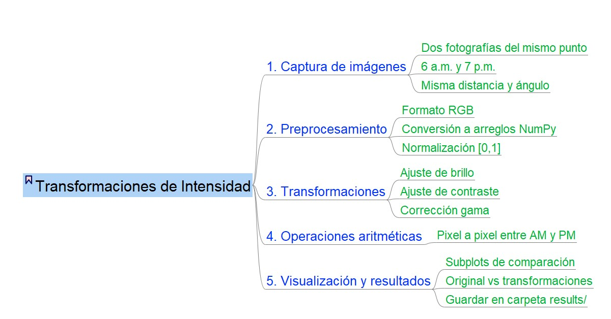
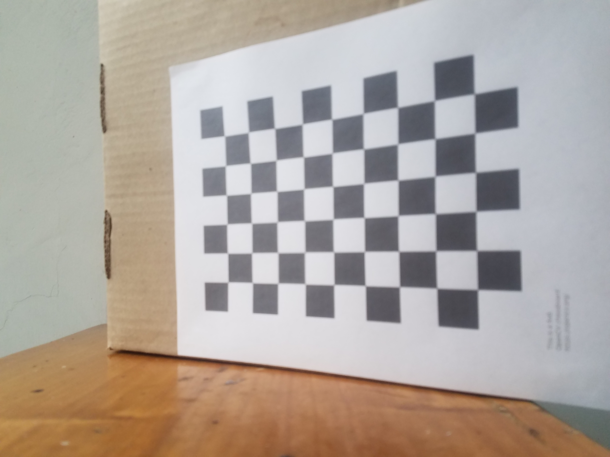
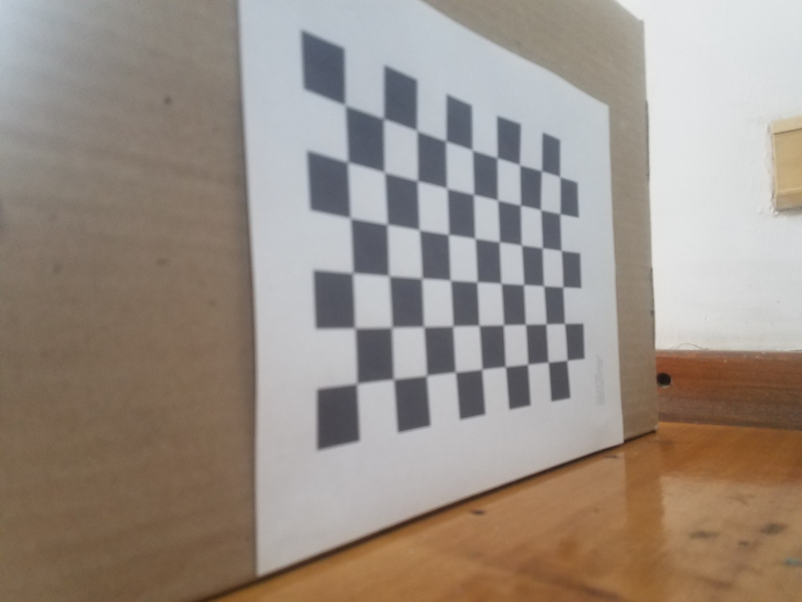
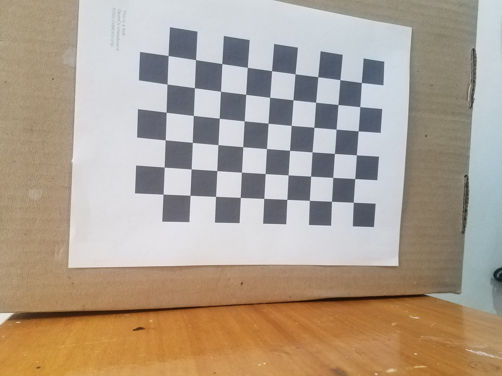
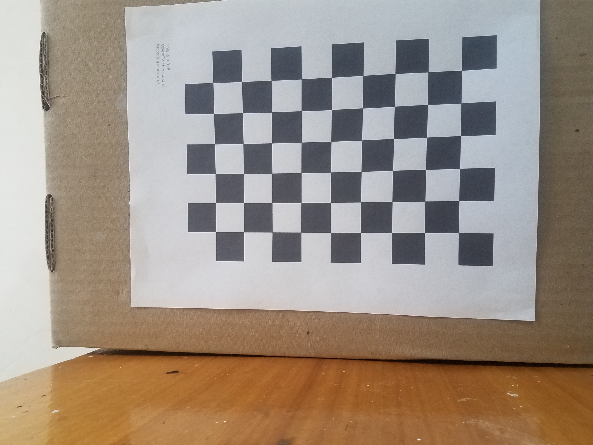
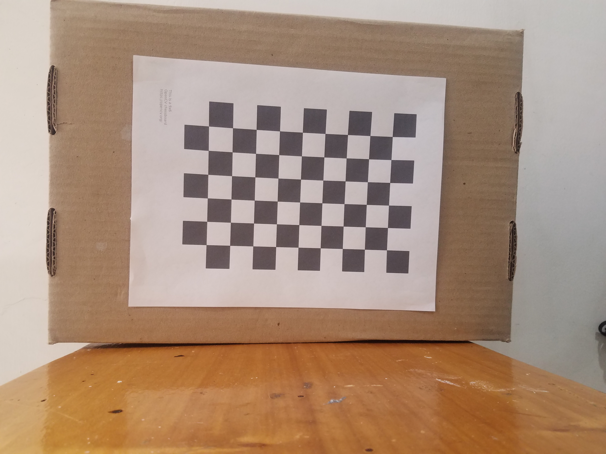
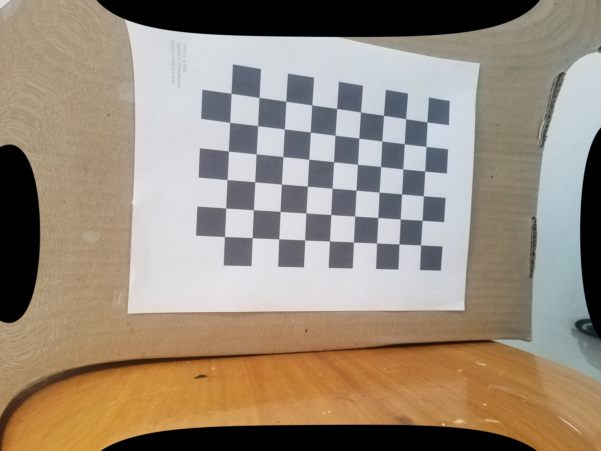
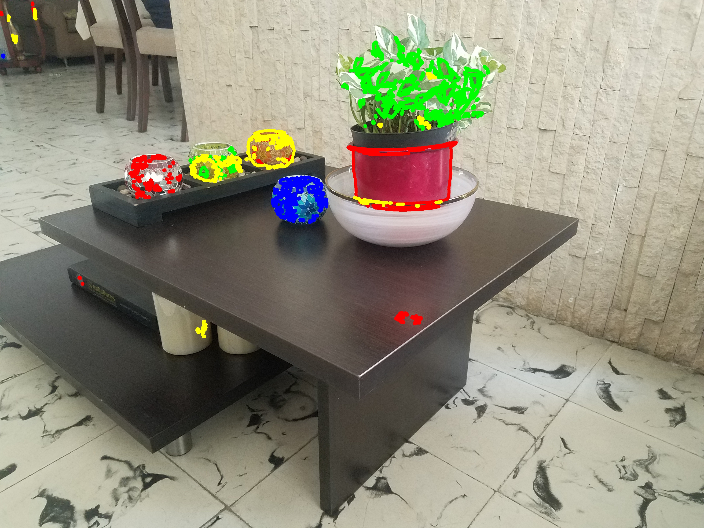

# **1\. Introducción**

La visión por computador es una herramienta fundamental que permite procesar y obtener información a partir de imágenes digitales. Para garantizar la precisión geométrica de las mediciones, la calibración de cámara permite estimar parámetros intrínsecos, corregir distorsiones y establecer la relación entre coordenadas reales y de imagen (Zhang, 2000; Duisterhof et al., 2022).

Por otro lado, las transformaciones geométricas permiten alinear y manipular la disposición de los objetos. Adicionalmente, las transformaciones de intensidad como brillo, contraste y corrección gamma mejoran la visibilidad y compensan diferentes condiciones lumínicas (Gonzalez & Woods, 2018). Mientras que obtener la frecuencia de distribución de la intensidad (histograma) y su ecualización permite mejorar el contraste (Patel et al., 2013).

Finalmente, la segmentación por color permite aislar y cuantificar regiones de interés. Estas técnicas representan el conjunto de herramientas aplicadas en este proyecto para mejorar, analizar y procesar imágenes.

# **2\. Marco Teórico**

## 2.1 Calibración de la Cámara

Uno de los primeros procesos en el manejo de imágenes digitales, es la calibración de la lente, Actualmente, existen cientos de modelos de cámaras, con parámetros y características distintos. Conocer de antemano sus parámetros y de qué manera este dispositivo transfiere la información del mundo real **(3D)** como una imagen digital **(2D)**.

Dado que en la mayoría de los casos las características de una cámara digital nos son desconocidas o inaccesibles, recurrimos a métodos prácticos y simulados para tener una estimación. Con la utilización de un patrón específico, en este caso un **tablero de ajedrez** con esquinas rectas y de un largo conocido y definido previamente, buscamos modelar las distorsiones reales que percibe la cámara al tomar una foto. (Sattia Mallyk, Kaustubh Sadekar, 2020\)

Realizando múltiples imágenes sucesivas desde diferentes ángulos y distancias del mismo patrón, es posible modelar artificialmente estas distorsiones que introduce la lente y determinar con elevada precisión como la cámara proyecta puntos en el espacio de la imagen.

Este proceso permite corregir errores de distorsión y establecer un modelo matemático que describe el comportamiento de la cámara, lo cual es crucial para aplicaciones en visión por computadora, reconstrucción 3D, fotogrametría, robótica, y otras áreas donde se requiere precisión geométrica.

Los datos que sacaremos de esta calibración los conoceremos como parámetros intrínsecos y serán: 

* **fₓ, fᵧ**: distancia focal (en píxeles) en los ejes x e y.  
* **cₓ, cᵧ**: coordenadas del punto principal (centro óptico en la imagen).  
* **s**: coeficiente de sesgo (skew), usualmente 0 si los ejes están ortogonales.

$$
K =
\begin{bmatrix}
f_x & s   & c_x \\
0   & f_y & c_y \\
0   & 0   & 1
\end{bmatrix}
$$

## 2.2 Transformaciones de intensidad 

Operaciones puntuales que modifican directamente los valores de intensidad de los píxeles de una imagen, sin alterar su posición ni estructura espacial (Gonzalez & Woods, 2018). Su objetivo es mejorar la apariencia visual, facilitar el análisis o resaltar detalles específicos. Pueden ser:

* **Lineales:** como el ajuste de brillo y contraste. El brillo se modifica sumando una constante β a cada píxel, desplazando la distribución de intensidades: 

$$
I_o(x,y) = I(x,y) + \beta
$$

donde β es una constante de desplazamiento (positiva para aclarar, negativa para oscurecer).

El contraste se modifica mediante un factor multiplicativo α, que expande o comprime la distribución alrededor de un valor medio.

$$
I_o(x,y) = \alpha \cdot (\, I(x,y) - m \,) + m
$$

Donde, α es el factor de contraste y m es un punto medio que permanece constante. 

* **No lineales:** como la corrección gamma, que ajusta la luminancia percibida aplicando una potencia γ sobre cada valor de intensidad normalizado.

$$
I_o(x,y) = c \cdot I(x,y)
$$

Donde c es una constante de escala y γ el exponente de corrección. Si γ\<1, los tonos oscuros se elevan; si γ\>1, los tonos claros se comprimen.

## 2.3 Transformaciones geométricas

Las transformaciones geométricas son operaciones fundamentales en el procesamiento de imágenes,entre las más comunes están la traslación y la rotación, donde, estas transformaciones se representan mediante matrices en coordenadas homogéneas que modifican la relación espacial entre píxeles (Herrera, Guijarro, Guerrero, José. (2016). 

Matemáticamente, estas transformaciones se representan mediante matrices en coordenadas homogéneas: traslación por vector (tx, ty); rotación por ángulo θ, escala por factores (sx, sy). La composición de transformaciones se obtiene mediante multiplicación de matrices y el orden importa: rotar y luego trasladar no es equivalente a trasladar y luego rotar.

## 2.4 Distribución de intensidades

El histograma de intensidades es una representación estadística que muestra la frecuencia con la que aparecen distintos niveles de intensidad en una imagen (Gonzalez & Woods, 2018). Así,

$$
h(r_k) = n_k
$$

donde rk​ es el nivel de intensidad y nk​ el número de píxeles con esa intensidad. Al normalizar se obtiene una función de probabilidad discreta:

$$
p(r_k) = \frac{n_k}{n}
$$

La distribución del histograma permite identificar características como brillo, contraste y rango dinámico. Por ejemplo, un histograma agrupado en intensidades bajas indica una imagen oscura; en altas intensidades indica una imagen clara y uno distribuido uniformemente indica buen contraste (Patel et al., 2013).

La función de distribución acumulada (CDF) se obtiene a partir del histograma y representa la probabilidad acumulada de que un píxel tenga una intensidad menor o igual a un cierto valor. Se define como:

$$
CDF(r_k) = \sum_j p(r_j)
$$

La CDF es fundamental en técnicas de ecualización de histograma, permitiendo construir una transformación de intensidades que redistribuye los niveles originales de manera más uniforme a lo largo del rango dinámico de la imagen (Gonzalez & Woods, 2018). Para esto se busca construir una función de transformación T(r) que mapee los niveles de intensidad originales r en nuevos niveles s, de manera que la distribución de salida se acerque a una distribución uniforme:

$$
s = T(r) = (L - 1)\cdot CDF(r)
$$

Donde L es el número total de niveles de intensidad.

## 2.5 Segmentación de Imagenes por colores

La **segmentación** es una técnica del procesamiento digital de imágenes, en la que buscamos dividir una imagen en regiones o segmentos que comparten características comunes, como color, intensidad o textura (Gonzalez & Woods, 2018). 

Dentro de este contexto la segmentación basada en el color permite identificar y extraer objetos de una imagen digital utilizando la información disponible en los píxeles. Para ello, es común trabajar en espacios de color distintos al RGB.

Aunque el espacio **RGB** es ampliamente utilizado en la visualización de imágenes, para este ejercicio se requerirá de más precisión y lidiar con cambios en la intensidad de la luz. Para esto se utiliza el formato **HSV** (Hue, Saturation, Value), ya que este último separa la tonalidad del color de la intensidad, facilitando así una detección más robusta frente a variaciones de luz (Color Identification in Images using Python \- OpenCV, 2023).

# **3\. Metodología**

## 3.1 Calibración de la Cámara

Nos preparamos para la realización del ejercicio desactivando en nuestra cámara las funciones que puedan obstruir las mediciones (HDR, AutoFocus, Zoom Digital), completado esto, pondremos el **patrón de ajedrez** sobre una superficie plana y realizaremos diferentes fotografías desde distintos ángulos, teniendo el patrón dentro del encuadre, previamente deberemos haber realizado mediciones de uno de los lados de un cuadrado.

Un paso de validación es necesario antes de buscar los parámetros intrínsecos, utilizando  la función *cv2.findChessboardCorners()* de la biblioteca OpenCV, buscamos detectar las esquinas del patrón, si estas esquinas no son detectadas no podremos realizar el siguiente paso por lo que deberemos repetir las imágenes.

Utilizando la medida del cuadrado en **mm** como referente, utilizaremos *cv2.calibrateCamera()* para encontrar los parámetros intrínsecos, esta función nos devolverá los datos que estamos buscando y nos permitirá guardarlo en un archivo aparte para su utilización posterior.

## 3.2 Transformaciones de intensidad 

  
Estas operaciones se realizaron a nivel de píxel y fueron programadas utilizando las librerías de NumPy, Matplotlib y Pillow.

## 3.3 Transformaciones geométricas

1. Prepareción de la immagen: se cargó la imagen y posteriromente se conviritió en RGBA.
2. Definición de la transformaciones: se construyó una lista con 5–8 configuraciones (tx, ty, θ, s). Cada configuración produce un frame.  
3. Ejecución de transformaciones:  
   \- Escala (factor s) aplicada con interpolación bicúbica.  
   \- Rotación sobre el centro (expand=True para evitar recortes).  
   \- Pegado de la imagen rotada en un lienzo del tamaño original y aplicación de la traslación (tx, ty).  
4. Guardar: cada frame se guarda como PNG numerado.  
5. Generación del GIF usando imageio, ajustando \`duration\` para la velocidad.  

## 3.4 Distribución de intensidades

Utilizando las imágenes obtenidas en el punto 3.2 se busca comparar cómo varía el contraste en imágenes bien iluminadas frente a aquellas con baja luminosidad y hacer su respectiva corrección. Para esto, las imágenes RGB fueron convertidas a escala de grises. Luego, utilizando la función np.hist() se calculó el histograma para cada una de las imágenes, lo que permitió comparar su distribución de intensidad inicial.

Posteriormente, se calculó la función de distribución acumulada (CDF) utilizando hist.cumsum() y se normaliza para garantizar un mapeo correcto entre 0 y 255\. Finalmente, cada valor de intensidad original se reemplazó por su nuevo valor transformado mediante indexación directa, obteniendo la imagen ecualizada. 

Las imágenes obtenidas fueron guardadas en la carpeta  *results/.*

## 3.5 Segmentación por Colores

Con el objetivo de identificar colores específicos en una imagen digital, decidimos emplear una combinación de **máscaras de color** y **Canny** para la detección de bordes. La idea principal se basaba en separar los tres colores primarios del espacio RGB (rojo, verde y azul) y, a partir de esta segmentación, resaltar con líneas los objetos que presentaran una mayor intensidad en dichos colores.

Inicialmente, realizamos una prueba con **rangos de valores bajos y altos en RGB** para crear máscaras que filtraran las regiones específicas. No obstante, los resultados fueron que los bordes obtenidos no eran nítidos ni representativos, y se mantenía la presencia de ruido o áreas que no correspondían a los colores buscados.

Tras una revisión de documentación y recursos disponibles, encontramos diversas recomendaciones que sugerían utilizar el espacio de color **HSV en lugar de RGB**, debido a su **mayor precision** y su capacidad para separar la información de tono, saturación e intensidad (Color Identification in Images using Python \- OpenCV, 2023).

Con esta información, definimos **rangos específicos en HSV** para rojo, verde y azul, generamos máscaras para cada uno utilizando la función *cv2.inRange()*. A continuación, aplicamos estas máscaras a la imagen original para segmentar las regiones correspondientes a cada color.

Una vez segmentadas las regiones de interés, desarrollamos un método personalizado para **dibujar, señalar y analizar los objetos detectados**. Este método incluía los siguientes pasos:

* **Aplicación de desenfoque gaussiano** a las máscaras para eliminar el ruido.  
* **Detección de bordes** mediante el algoritmo de Canny.  
* **Detección de contornos** usando *cv2.findcontourns()*.  
* **Cálculo de áreas en píxeles** para cada contorno detectado.  
* **Aplicación de un filtro de tamaño (size filter)** con el fin de eliminar contornos demasiado grandes o irrelevantes que no correspondiera a objetos válidos dentro del análisis.

# 4\. Resultados y Análisis

## 4.1 Calibración de la Cámara

El ejercicio de calibración fue llevado a cabo con 5 imágenes con la cámara se un celular modelo Samsung Galaxy S7:

  
  
  
  
  

Los resultados mostraron una deformación en forma de cojín al ver como las imágenes se hunde de cierta forma en el centro de cada lado de la imágen dando la impresión de un cojín.

A parte de esta deformación que es el aspecto más visual, vamos a encontrar como ciertos valores presentan ligeras variaciones, uno de estos casos es el del *focal length* en el cual tenemos los siguientes resultados: 

$$
(f_x = 3.16386392\times10^{3},\; f_y = 3.18629093\times10^{3})
$$

Estos valores pueden ser en la mayoría de los casos iguales, estos dos puntos representan las direcciones en **x** y en **y** que podrán diferir dependiendo del tamaño de los píxeles de la cámara, otro valor a tener en cuenta es el de cx y cy los cuales nos dieron como resultado.

(cx, cy) \= (2.00104091e+03 , 1.55433682e+03)

Tenemos que tanto cx y cy que serían las coordenadas del centro óptico que hemos sacado de acuerdo a la calibración, estos dos puntos están relativamente cerca del centro original aunque notamos una mayor variación en los valores de y, lo cual podría deberse al hecho de que son los lados superior e inferior los que presenta una mayor deformación en las imágenes corregidas.

cx \=2.00104091e+03  \=  2.00104091 x 10³ 

cx \= 2001.04091

cy \=1.55433682e+03  \=  1.55433682 x 10³ 

cy \=  1554.33682

(cx, cy) \= 2001.04091, 1554.33682 

(ix, iy) \=2016, 1512 

Tenemos entonces que ix e iy representan el centro según las dimensiones originales de la imagen en este caso estaríamos hablando de que cx está a 14 pixeles a la izquierda del centro de la imagen y que y el cual está más separado, esté 42 pixeles por encima del centro de la imagen.

d \= (cx-ix)2+(cy-iy)2= 44.87 pixeles de diferencia

Lo más a destacar de los resultados es la variación en y, tanto en la **distancia focal** como en la distancia del centro de la cámara al centro de la imagen que presenta una variación mayor, esto nos hace intuir que los píxeles de la cámara presenta un tamaño mayor en su altura dando lugar a estas variaciones.

## 4.2 Transformaciones de intensidad

**Brillo**  

 

Se puede observar en la imagen de la fachada AM al utilizar un beta negativo la imagen se oscurece de manera global, desplazando la distribución de intensidades hacia valores más bajos. Mientras que en la imagen de la fachada PM con un beta positivo se desplazan las intensidades hacia valores más altos, la imagen se aclara, es decir, se produce un aumento del brillo general. 

**Contraste** 

  

En la fachada AM al aplicar un α=2 y un punto medio de 0.5, se produce una mayor diferencia entre las intensidades, las regiones claras (como el cielo y las fachadas) se vuelven más brillantes, mientras que las zonas oscuras (árboles) se oscurecen aún más. Esto incrementa el contraste global, pero también puede generar pérdida de detalle en zonas oscuras debido a la saturación.

En la fachada PM al aplicar un α=-1 y un punto medio de 0.5, la relación se invierte respecto al punto medio generando un efecto negativo, las zonas oscuras se vuelven claras y viceversa.

**Corrección Gama**  

 

Para la imagen de la fachada AM, al aplicar un factor gamma γ=2 con una constante c=1 se genera un oscurecimiento. Esto se debe a que los valores de intensidad inferiores a 1 se elevan a una potencia mayor lo que desplaza parte del rango dinámico hacia valores más bajos. Esto produce una pérdida de detalle en las zonas oscuras y del primer plano.

Para la imagen de la fachada PM, al aplicar un factor gamma γ=2 con una constante c=1 se produce un efecto de aclarado no lineal, ya que los valores bajos se amplifican al elevarlos a un exponente menor que 1\. Esto mejora la visibilidad de detalles en regiones oscuras, como en los árboles y las fachadas inferiores, sin sobreexponer las zonas ya iluminadas como las ventanas.

**Operaciones aritméticas**

 

La suma de ambas imágenes produce un incremento en la intensidad al combinar los valores de brillo de las dos imágenes. Así, la imagen se ve más clara y brillante, con detalles visibles en los árboles y  la fachada. También, se observa saturación en las regiones más iluminadas como el cielo y reflejos.

La resta realza las diferencias entre ambas imágenes evidenciando zonas en las que la iluminación cambia significativamente entre el día y la noche. Se observan cambios en el cielo y zonas oscuras en la fachada donde había más iluminación en la noche.

La multiplicación pixel a pixel genera una imagen más oscura ya que intensidades menores a 1 reducen aún más el resultado. Se observa una pérdida de detalle en toda la imagen especialmente en las zonas más oscuras y alcanza a evidenciar levente un realce en la zona donde hay iluminación alta en ambas imágenes.

La división amplifica intensidades cuando los valores en la imagen PM son pequeños y disminuye las intensidades cuando los valores de la imagen PM son grandes. En este caso, la imagen de la fachada PM tiene valores bajos de intensidad lo que amplifica las intensidades dando como resultado una imagen fuertemente aclarada y contrastada, con zonas de saturación extrema en árboles y fachada. 

## 4.3 Transformaciones geométricas

Este ejercicio permitió observar cómo las transformaciones geométricas influyen en la apariencia y trayectoria de una imagen aplicadas de forma sucesiva. El orden de las operaciones es muy importante, ya que, modificar la secuencia entre escala, rotación y traslación cambia bastante la posición final de los píxeles.

La función **transform** es la que permite ajustar el tamaño mediante escalado, girarla según el ángulo de rotación y desplazarla en el plano mediante traslación. Para evitar que la imagen recortada pierda información, se crea un lienzo del tamaño original donde se pega la versión transformada de la imagen, garantizando que  la imagen permanezca dentro de los límites visibles, siendo esto una herramienta esencial en visión por computadora que permite modelar cómo un sistema percibe los objetos independientemente de su posición, tamaño u orientación.

La función **generate_transform_sequence** se encarga de aplicar varias transformaciones a una imagen y crear un GIF animado con todo el proceso. Con la imagen principal (base), le va aplica distintos cambios como moverla, girarla y escalarla, guardando cada paso como una imagen separada (frames). Luego, con la librería imageio, se juntan todos los frames como una animación, mostrando de forma visual cómo la imagen se va transformando poco a poco.

## 4.4 Distribución de intensidades

 

Para la fachada AM el histograma tiene una distribución a lo largo de todo el rango dinámico con un aumento en valores bajos. Aunque la imagen tiene zonas oscuras como los árboles cuenta con una iluminación más equilibrada que incluye intensidades medias y altas. Por el contrario, en la imagen de la fachada PM el histograma se concentra principalmente en intensidades bajas, lo que refleja una escena predominantemente oscura.

la CDF en el caso  AM el aumento fue más constante con una pequeña meseta \~ 100 y 200 y un aumento casi lineal al final, mientras que en el caso PM se evidenció un cambio más pronunciado al inicio y una meseta \~ desde 100, lo que evidencia un aumento de intensidades en las zonas más oscuras de la imagen.

En la imagen AM, la distribución de intensidades ya era amplia y la transformación de ecualización fue más suave, con cambios leves en los niveles de intensidad y un incremento moderado del contraste.

Por otro lado, en la imagen PM, el histograma estaba concentrado en intensidades bajas, la CDF extendió significativamente estos valores hacia todo el rango dinámico, generando un aumento fuerte del contraste.

## 4.5 Segmentación por Colores

El resultado obtenido demuestra que el sistema de segmentación implementado es capaz de **delimitar los contornos** de los objetos presentes en la imagen, independientemente de su ubicación relativa (cercana o lejana) dentro del campo visual.

Además, el algoritmo desarrollado no solo segmenta los colores objetivo (rojo, verde y azul), sino que también logra **resaltar cada región con líneas de contorno claramente visibles**, aplicando un grosor que mejora la percepción visual de los límites detectados.

Este comportamiento es posible gracias a la combinación de varias técnicas implementadas:

* La utilización del **espacio de color HSV**, que permite una detección más robusta de los colores frente a variaciones de iluminación.  
* La aplicación de **desenfoque gaussiano** que elimina el ruido en las máscaras.  
* El uso del algoritmo de **detección de bordes de Canny** y *cv2.findContours()* para obtener contornos nítidos y precisos.  
* La visualización final con *cv2.drawContours()* o funciones similares, que permiten resaltar cada objeto con trazos diferenciados y adaptativos.

En conjunto, estos resultados validan que el sistema desarrollado no solo es funcional, sino que es capaz de realizar una **detección y visualización efectiva** de los colores de interés, así como el cálculo de su área y conteo de los bordes detectados.

# 5\. Referencias Bibliográficas

Zhang, Z. (2000). *A flexible new technique for camera calibration*. IEEE TPAMI.

Gonzalez, R. C., & Woods, R. E. (2018). *Digital Image Processing*. Pearson.

Herrera, P. J., Guijarro, M., & Guerrero, J. M. (2016). Operaciones de transformación de imágenes. En Conceptos y métodos en visión por computador (cap. 4). Madrid, España: Universidad Francisco de Vitoria.

Patel, O. et al. (2013). *SIPIJ*, 4(5).

Vinayak Ray (03 de Enero de 2023). Color Identification in Images using Python \- OpenCV. GeeksforGeeks. [https://www.geeksforgeeks.org/python/color-identification-in-images-using-python-opencv/](https://www.geeksforgeeks.org/python/color-identification-in-images-using-python-opencv/) 

Gururaj (26 de septiembre de 2024). Choosing the correct upper and lower HSV boundaries for color detection with cv::inRange (OpenCV).  
[https://www.geeksforgeeks.org/computer-vision/choosing-the-correct-upper-and-lower-hsv-boundaries-for-color-detection-with-cv-inrange-opencv/](https://www.geeksforgeeks.org/computer-vision/choosing-the-correct-upper-and-lower-hsv-boundaries-for-color-detection-with-cv-inrange-opencv/)

priyarajtt (15 de Julio de 2025). Camera Calibration using Python \- OpenCV. GeeksforGeeks. [https://www.geeksforgeeks.org/python/camera-calibration-with-python-opencv/](https://www.geeksforgeeks.org/python/camera-calibration-with-python-opencv/)

Kaustubh Sadekar, Satya Mallick (25 de Febrero del 2020\) Camera Calibration using OpenCV. [https://learnopencv.com/camera-calibration-using-opencv/](https://learnopencv.com/camera-calibration-using-opencv/) 

# 6\. Reporte de Contribución Individual

| Estudiante | Aporte Personal |
| :---- | :---- |
| Leidy Marcela Leal Loaiza | Ejercicio de Transformaciones geométricas|
| Juan Felipe Arbelaez | Ejercicio de Calibración de Cámara y Segmentación por colores. |
| Bibiana Andrea Peña V | transformación de intensidades y la ecualización del histograma para mejorar el contraste de las imágenes, incluyendo la implementación y validación del procedimiento. Además, participé en la redacción del informe final y en la organización de los archivos comunes del proyecto, contribuyendo a mantener una estructura clara y coherente para el trabajo en equipo. |

[image1]: <data:image/png;base64,iVBORw0KGgoAAAANSUhEUgAAAmIAAAEnCAYAAAAKKy+kAABERElEQVR4Xu2dTZMc1bmgtZuI2czs5wd46SBYmNpOxF3NaiI8EaNZTEfYEXV3M7NxzIoIyTZGCCgEBBJggXTFl22wLkKijH0Bt2gug0wbzIewu22oxkBjdMFcGgOXDymn3pN5Mt/z5jlVWd3VVd2dzxNxoitPnjxf3Sgf3pOVZ18GAAAAAHNhn80AAAAAgNmAiAEAAADMCUQMAAAAYE4gYgAAAABzAhEDAAAAmBOIGAAAAMCcQMQAAAAA5gQiBgAAADAnEDEAAACAOYGIAQAAAMwJRAwAAABgTiBiAAAAAHMCEQMAAACYE4gYAAAAwJxAxAAAAADmBCIGAAAAMCcQMQAAAIA5gYgBAAAAzAlEDAAAAGBOIGIAAAAAcwIRAwAAAJgTiBgAAADAnEDEAAAAAOYEIgYAAAAwJxAxAAAAgDmBiAEAAADMCUQMAAAAYE4gYgAAAABzAhEDAAAAmBOIGAAAAMCcQMQAAAAA5gQiBgAAADAnEDEAAACAOYGIAQAAAMwJRAwAAABgTiBiAAAAAHMCEQMAAACYE4gYAAAAwJxAxAAAAADmBCIGAAA7hu7Za7J95zphOruQddfXbNFN4+vtrIyoc/1gtm95yeZuD9JW0acsWyt+Tp/x9S4N5/pg1rfZDVhdWRg9nzuU8XOy/SBiAACwYxARsyIgN3m5Ydr8zdLo5jtDEZuVxIwf9+ZFbLcyfk62H0QMAAB2DDERE5yMeTFSESRJ3fWi0MapID8mUvq8I1pXHpUaX86UPZsLoy/fWS6uWTzlsvT10Xpdf3MZ8vSX8zrDMlmjsQrRNod0dORx2O+cuIj1l6/JuitVeyKN9lotk0Hdqk13rTon9frPvY2yWKJvIbYune/RfzO6P67tYV5vUbVTlGvS9rRBxAAAYMeQEjEnHoWg6JutPpZr9Q09RerGHRybiFiqnNzMrQg65Hp1Ixfp0FEvfV0YEQtFLGy3WrZsMtawzeraQGqL47xcWsS8TAZjzPL+rWa2joXyvMaXFUR4yr7JXBX12765tiOSKXX5frprlOx6rIj5tvW8pMoLqbanDSIGAAA7hvEiVr/R+2v8Eqak3kr6BlrdfNN1hSKWLpcSNC0Xnq6OwJyromqjRCzbWAqu8fU3GaudS39tEAnyqZzbuIiF/Vsoz8m1oYjleS4tHizlx+d7ApEs52opIphmPgp0XU4yiz7pfCti4/Kbtj1tEDEAANgxWHnwVDfPtBR5+moZLUaVP6KuCUQsKhsmoubkxxyPF7E8ilXVX3+Qf9RY7bz4MnXh8KRFrFqKHS9iOWtD8Vxw52PRJ0SsAhEDAIAdg5UHwT8n5YXESoc/luUufa0ca0ny6OtTdVmRSpULliblxp243t7ktaCkRcwIYPE8mdBkrCOXJnW0TonQlkVMLSE75DiybBgXsebLg/rvISVWWn51fqp807anDSIGAAA7BrlBy83Rp87iQk0whF4hZ53lcPnP5+9LXCfom6+Qqss/uO3rSZXzotjfUHUbERP80qR7FYeRj7iIDc+tFxGv4XiEWH9GjXW1kDdpMxj3xlI5vl75apApiJig6u6qZVPdfkrEHGo5VuY0hmtXja2i+CLB4sHgd6Db1sK1upLXUT0DN77taYOIAQAAbJIwMlVfwoTtIZDKXQ4iBgAAsEl8VMan+LNXMG0QMQAAAADYMogYAADMhX6/nz3yyCPZpUuX7CmA1oCIAQDAzLnppptsFkArQcQAAGCm3HjjjTYLoLUgYgAAMDOQMIAQRAwAAGbC5cuXs/X18oVUAJAhYgAAMCPuu+8+mwXQehAxAJiI7lVZ1jlhc8cwGP5jc7VJ+22hzSP1zYPOcC56A5s7nn1X2ZzJkTGn3qa+Uzl9+rTNiuLfVO/fJr9TSW+eDdAcRAwAGiPiIQIwqYjFpEGEbloytttEbKusnhjO33mbu7P5/PPPsy+//NJm13ByI9vTZLKh9cKuelO9vGWfF7rCpCBiANAIkY7uieGNcv9kIibClZKG7rXqYKBETwvaoIggyU+JpF1VSV3/2iKvSIL81Hvl6fbls5wLInKDRLsR+ieqa3vn6yKmz1vx1JQRsYEZm+qTH2vAoOqrJOmDRrcv2OtlfHJefo8l5/Nyq/JT90Hhr4uNy58bN3ePPfaYzYpg9kMcQ3dxoYyc2X4Jfo9Et8djIXR+b8Fqf8U4UkbXaTeEttQ20la4Mcnm1+fCvRc1YZm8b037CrsbRAwAJmJSEZObdOwmGTAIy3Xl5q5lRUmJFwZdpxzrz6NEzF/bH2Sj2zXIuMs+DIqyIkOD+HnbR40dW6cQUleHkiFdp+2rP/btOyk17euxyHE5D1KvF6diPn0f3BwlrrPjcu37c4XQpTh06JDNqiMiMpSZctugIjIWQwuKKx+JnImIeaFy0TWRHLmm2Nh5FOFG15nbpNpuhq0ZVV8+llzSJGqm6/VImY4TvWLT6uF4mvYVdjeIGABMxGZEbDOU1w3qdTjpUNE0fV4+jxKxcX23bXli+VqE7PnVE2EfNVauSuxxVj/W6LFpQRJc+0U7TuhMX8p6rUANRl+nx+XmeqDPpvnNb35js+oUApYLicjQQlSwNKvrS3nEKyIrIlOdIrpkN+T2gpZGyh8s/5Zi9ZdIvxPRMCG8Nq/XosuI9OklzvF9hd0MIgYAE7EZEUtFEsolskFeTpJEZnzkpTxnIy1GHiYRsWCZdDCiXUMsX+rTIlZLtt8FgYiZMrVjPQ++r/vzSJRbLlYiZvF1+UigTW6erIhlVV2p63T5cjnU5GteeuklmxVHImJGUiSCVP/7yaNGlZzElzTDqNakIpYLkQiWjY5ZYm1rwvNrUblExNoLIgYAEzGpiLkIyn6bmwXRn5ogiRx4sRiozwXjImL6uS0tK7Ydexy0a5B8ezPUbaWui7EZEav1tTjXNCKW/J2NELGR10WQ6+rSNKyn17NZSazU2OOcUKp8JM2yVRErI3RDMUoTFyuNbiv1rBki1l4QMQCYiElvzoJ7wPyqPOIk+CjKqOerrIh5mfPPiGn0sX7GyT/MnxKxke0a/DNY7oY4yGrPiI16tsqyGRELnhfLqvZ9G/oZsXLOTH/881x+XhwjRMx/1l8K0G3qz7Hfi+fMmTM2K41/PqxIqUiULiNRq1JkXFRtwX1sJGKqfJ21/FucyfNZ+VzbKIK+KuHS37JsJGIj+wq7FUQMACYiJmJOEgpRSiE36lHfTvRi4R8al89eepwAFTf6WDv+IXcfNSgl6XwoX1bEdNlauxF0H0Z+a3KYP+rZqc2ImOD76ut3QqXmI/jW5KBeV/kNR/3c1xgRE8pvTUbGpb9RGeOzzz5r9NqKnYpEsKrnzDaHliwACyIGADubQV0UoI4VSCtp8+Luu++2WbsG/+3NrTKNOmDvgogBwM5mgIg1wb5TzUa15sWLL75os3YF/mWy7hUSWwQRg1EgYgAAsC3cdNNN5WfZ8Pu1117LHn/88ezkyZPZkSNHXDpw4IBLkuc/k5ol2BsgYgCQ5Mc//nHtH38SqWkS0br//vuzCxcuZF999ZX98wKADBEDgATvvvuuzQKYiPfffz/75JNPbDYAKBAxAKhx6tTor+MDNOXw4cM2CwAUiBgA1Lh48aLNAtgUH330kXs+DADiIGIAELC+nniDJsAmefTRR20WABQgYgAQcM8999gsgC1x9OhRmwUABYgYAAScPXvWZgFsiTfffNNmJbHbAJUUL1f1e1lGy8wI33aTt+5vVz+3q16/rVNqa6mtIFs3xfYibTuIGAAEfPjhhzYLYMs0fe5QBKO7aG/YS+4mvlNu5JNI0CRl9zo75fe300DEAKBEXjcAsB3ccsstNiuK2+BaNrdeXirzZPPufWcPBjfyUnCkbBFFc6m4zm34vVKdk8hVWcZs/q1Tilg5HRGTDbztebdhuDruLy+E9ai+dhbVueFYPdKGrVewn2NlKmTD86rOVMTL1jO+f+Gc+rZdeRUp9Pn69xfMV8s3MkfEAKBE3m4OsB28/fbbNiuK3Jhlz8xKKNbcjV9u4DERc7KzWEmGJ5QBEZGF8pxvo2RjLeut5EufMUGRdnsb1bFvuxKxXEj6G/VlymocFavrSy7qp8VFi2cw9sj1Qi2/wRjs3EUZ1tO0fyJTeh51+VEiVhNBWXZebO8rcxAxACi54447bBbA1Fhaqm7mKbwkuYjWei47/qadkomOijx1dESsvNknRMxH04bnJHpWE4QCEQ69pObb1hExv0G4T15Qgn4WUaDOUBxF2saJi41kacoyDccgsuPakH4qqSpR9TTtnx6bPk6V97+/+hJlepxtABEDgJKnnnrKZgFMjWPHjtmsGpXE5DdnkRdPSsQqcnnQIpcTFzEb6XLPoUUkxpbzbace1ncbhhcRnlCqFsoy7niMuDSJiNm+pcYgSPsiaqEE5dh6mvSPiNh0QMQAoOSdd96xWQBTQ/abHPeeukrE8s9aXmIili9NFjfxjVAexomYu9ZH0IpnsWJi5aNFgn/OS6gvTebFdb3VeCpJ1M9WCSlxEUR2Oit5XfLZjykYf5MxZPn86bo1up6m/XPPrxXzqpcy/TdcBf+cnCvjf3/FfK7KfBWRt1AC2wUiBgAONmWGWXDrrbfarIBKVvKbuBaAmIgJPf8Q/OJCeW0TERO8QHTXi2W7RGTGLz1KOS0iZf+GEuiXHruFOOVl8uukvdX1Yvlv2E/B56dExxP0sUCXaTwGFamL4euZpH9eTEVCdb7/nej8YEmykGZfps0gYgDgWFlZsVkA28L9999vs2AGiNhOM/IUPjtnl16hKYgYADieeOIJmwWwLUj0FRmbLS76NGVRsl9QmKbktQlEDAAchw8ftlkA286zzz6b3Xbbbe7VKQcOHCCR7J/IngcRAwAH+wECAMweRAwAHGfOnLFZAACwzSBiAOBYXl62WQAAsM0gYgDg4B1iAACzBxEDAAfvEQMAmD2IGABkly5dslkAADADEDEAyF555RWbBQAAMwARA4Ds0UcftVkAADADEDEAyI4fP26zAABgBiBiAJAdOnTIZgEAwAxAxAAgu+GGG2wWAADMAEQMALJ77rnHZgEAwAxAxACAh/VhS3TOXpPtO9cJ09mDttj2sn4w27e8ZHNH0o31e5j6plxveaFWpru+Vp6Pjb+7rioAGAEiBgDZ+fPnbRZAY0RErLzMnE2KWK3fG6cCiewvDyVrsS6VIlurxWcZv/+cs+bOAzQBEQMA3iMGW2KkiIkgxSJFw/zOcnFu8ZQTnu7KqbJcZyWXGZfOLmS9jfyyvo1OOflSZQsZC6JUw+tjREVM+luI2OpK3laUjTAihojBZkHEACD74IMPbBZAY2JLczl1IZFjJy0iPEMB84iIiXzlLAXy5OpUZYXV9aWsu5i361ARsd4wP1gaNG15YkuTesnRnTdLrLqs729s/LoegFEgYgAt5/Llyy4BbJZ0REyEKhSZMgpllhJdRKyUp7SIeenpLB7M+htK9FR99UhXvR+CLZcLVHUsQlfWb5BomRaxMCIWLl0CjAIRA2g5H374oc0CmIi0iI2JiE0sYmG+O46I2CQRsZqw6f5unHJj88uimnEiVq8bIA4iBtBy3nzzTZsFMBFpEcvPdZZzCXLfPvQitSkRy8Uul57quTCHli154F7KiUAVUbOYTMVkyUXBAmnLr/djcGWK59R8f62IrRbPxQE0AREDaDkvvfSSzQKYiFEiJnhx0TKzORETySke6F/Mz1diVixbljKWR7ck9SMSJsRETHDXmLz+SvWlg+5K+O1M+4yYLJvaCBlACkQMoOUsLi7aLAAAmBGIGEDLOXPmjM0CAIAZgYgBtJxTp+oPMQMAwGxAxABaTq/Xs1kAUd54443s8ccft9kAsAUQMYCWc/Bg/f1KABYRdl51AjB9EDGAlnP48GGbBRBw7NgxmwUAUwIRA2g53GRhFF9++SVbYAFsI4gYQMt54IEHbBZACc8QAmwviBhAy3nsscdsFkDJa6+9ZrMAYIogYgAt5+mnn7ZZUfZdHaambw7vXlW/VlLnWlsSNDJvvYHNnRyZ681y4cIFmzUS/wZ9eSt+6m3280bvEVkib/kP9rDcrcQ3N98MsutAbZ6mVX+xBZVOdreCNoGIAbScl19+2WbVECnong/zmt7gY9cKcr3dRgamT9PfU4yTJ0/arCiyPZHdVFuEZyo3bZiAKYlSVoiY3Tx9WvWLiNlN2J0MH2zlvwmIGEDLkXdDTcyg+Q2+iYjtU1GzMk9H0Pb7q7KsI5GiE+nzrr1ri/yrirz9YXn9j73UV54ryntSbfRMfZI8qyfS56St/vnw3Ko59tiImK2zHINcb6KOfr5r9Q5MPWpMMd555x2bFUUiGjF01DTYj9HuI6mSG5fZh9JtxO3bMNGUUhSG13SWi/0g5SZvoy5FfUFErNic29YlYtlZXKj3y9D3EUDThiUoc66aK/ns50Xmyh4LqXnzcyKpu+zHpEQpMbbUvFj8Ppy6v7p+N0cqYubLuT1DV6o2pEyt/zERK+qWNsM9QPPr9zKIGEDLuXTpks0aiwhF54TNjRMTMScySnq0gPhjLSG6DidORpgkz593S6F62bMQlZKBas+c0+2O6oOTmMTSqpwLBMT2XV1nZciOI9UXn+coRK4kMib9Wdej27O8+OKLNitBuEF3DBcdMxt8+2O5yfr50jd3ffPVwmBvyuWxWV6Um3kvsjyqRSxVl43wWenwhNfHhcFeKwLlpUjK6z7aYztvVd/DtkTWrIjZvvjj1LxYShkSaSqjYM1ErNp4PRcyXcb9rmsitqbGkIUibqR8L4KIAbSczz77zGaNxErUOGLPiHVPhGUCkYgcO7kohMVFxAbB2TwKVZy34if9tdLoZSl2zjOqD+VYhserg6BUieT3isicFrGU3NljK2IWPwYrXv7cuM+CnjfLLbfcYrMSrI0VsfrNPy4MWjysCOQREhVdUamMoqmbu6urON9Tzx9VMlMXSN+mlQwrRCUbS7W+xOiq6JUkLWJa2sPjtSDqVSaZNyMn4ZhkXtNjS82LRUelqt9fMxGr8sN+lOOzUTnpy3oour6+MDq2N0HEAFrM119/bbNG4qRqAgkTrGzEsIKgpa1MRbtueS8sHsiIbc8eC1Kf1BE756m1r/rg0UueXpq8eHaG53rn6xExK2L2OCViseTmYQsiFrvW88gjj9isJP6mafE33s2ImJcLHUGyN/aAROSkr5bJhOmJWC6FWpxi8+BkyiyzahHThMdLkXkriEhnUxHz2Hmx2PJ5uWYilvp9lfNVi4jVkfb9cu1eBxEDaDEff/yxzUriltX229zxjJIdjxUEe6yJLaf1JfJULPnZ9vQ5j6/fntPHo/pQQwmNvU6OpyFiSSIylZIvW48dv2aSl7japTxhVS0VWpGxS5OesFweabM34lB+1LERMVnq0iIhx1Ku6dLkeBEzslM8k2WxMiVlxrXvce3qeS0FLJQ+aaPp0mRqXixWxPK2F8r6a7+rKYtY+cxfbd73HogYQItZXw++EpVk9URWu9k3xYpRDCsINvJmZcZFgwb5sX/Y3RNrT85LdEqwQlnWNSg+F/mj+iCf5Zy/gUmdfolT981HzLYqYrYvTqD8mCcQMb2s7OctdhN+/vnnbdZY7PKbFYHUQ+e6nBUed035fFKBeQi948vbiJhd/lqsBCJ4FkmVCR7WHytied+r+sPnoUpMG31Vly1vj4Vg3tT5qT2sX8yLpSZimf196IfwKwmdmogV9UcjgnsMRAygxayuxm7Ddbz82ORxN3glN5qYGFl0XZ7+iaKdqyqxEbzMlMuCpt1Ue7JU6KTohD1TlztPqg+C/rZj0N4gvMZJU9HHzYqYoPsSvINtjIj5b3j633RZz/64hAnXX3+9zYIdTCg/ewctnnsZRAygxUz6ws6dgJUZmC7yyoorV67YbNhhBFEt8zzYbsctXbckGiYgYgAtpulb9XcSiNj2cuedd9osANhGEDGAFnP27FmbBS3lvffey2688cbs/fffd8+I3XXXXdmxY8eyJ598Mnv11Vezt99+O/voo49cAoDpgYgBtJiHHnrIZjkuX76c9Xo9d1OGdiC/68OHD9tsANhmEDGAFnP8+HGb5SBS1l4kKgYAswMRA2gxt956q83Kbr75ZpsFLeLLL79k+RFghiBiAC3muuuuC44/+eSTibc8gr0HS5QAswMRA2gxVsTkuTCA3fhaE4DdCiIG0GKOHj1afv7qq6+yL774Qp2FNvPMM8/YrCTVFjsa9Zb3mZHe4mcaxOrczPuu/Pu/PL3lBXfcWR73tnlhKXjLv60Ldh+IGECLOXWq+of/0UcfVWeg7Uzydn0RsboMzFfEZoLsh1gT0PHoudL7dLpti0Zu/VNsK2S2W6rPPewmEDGAFvPzn/+8/HzkyBF1BtrO8vKyzUri9iWU/QMDCTJStLFURm/6ZhNst0F4EVlyUlHsh9gtJMfvt9hbr6Rndb3aM7G74sWkHhHzklgm9Rb6rmxiLXnDn3q7p7LuYX5XtRkIT4PxpCJcup6gzsixx+136etGxPYUiBhAi3niiSfKzy+//LI6A5C/W6wJfoNoieiEGz4XIlaI1aoTlnAz51x4KmHJBUZEo4j+eHEqxMchMmI2k87rq4uYRvrnI1jumkKynNyU7RR99fnDz37z67LOceMpREkEMrYHZNW3tdr2RHJNag9QByK250DEAFrM0lL+D7p8WxLAIm/Xb4IXMaGSgkqKQkHLcpko5MtLj0dLhdSrn7+yZbONtay3kstSXv8IEVNtalbXl7KuLAkW5Wt9VSTLmPF4XBTLSJMwTsT8XEZBxPYciBhAi3nppZfcz6eeesqcAWj+Yl8tYpWUVFIUnHekhamRiBURKZGY7sopJUapelU0rcAvd3YWD2b9jTyqJdT7WpEuE293syJGRKxdIGIALWZ1Nf8nn5e4QorBYGCzalgxyQWqeURM00TEbL4cjxIx20ZebiE8LsrU+qpIlkmMZ7yI1ftmj2sgYnsORAygxayv53eTe+65x5wByGnybjkrYoLIQfQZsSL6pJ+p0jQRMfftwkJG+sVD7PmzX3URkwhT/fUSeR/y/w0pnkXz7QbPiJ0KnvOqlRkzniYiln9TshLW2PJpACK250DEAFrM559/7n76yBhADL5RO12ai9NSRCLrNK8PdiKIGEBL8S9vlZ9XrlwxZwEq5O/j9OnT/J1MiWbitJb1FhdsZpRm9cFOBREDaCkffPCB+3nx4kVzBqDO5cuXsyeffDJ74YUX7CmYkGApdItMsy6YD4gYQEtZW8vfodT0m3EAnmeffTa77bbbspMnT2YHDhwg7aAEuw9EDKClvPrqq+6n3FABAGA+IGIALeW5555zPw8dOmTOAADArEDEAFrKL3/5S/fzwQcfNGcAAGBWIGIALeXhhx92P+V5HwAAmA+IGEBLOXr0qPv58ccfmzMAADArEDGAliLPhm1sNHhbJAAAbBuIGEBL+cEPfpD94Q9/sNkAADBDEDGAlnL77bdnTz31lM0GAIAZgogBtJRTp05l9913n80GAIAZgogBtBR5o/4NN9xgswEAYIYgYgAtRV5bceTIEZsNAAAzBBEDaCmDwSD7xS9+YbMBNsFaZOPppWzf2YMmrxn9lc1dV7J+MNu3vGRzk/SXr8m66zY3jh9n9+w1WV/9BNgsiBhAS5FXV7z88ss2G2BinMgMU29Kb0OpS92EbKOIeRAxmBaIGEAL+fzzz93PDz74wJwBmJxcnGwErDrWYrW6slBJ0saSOyepu77msnqL15R5nt7yQtY5m+f3R8ieK3N2oSZicr1c21mMR9q8iHWk7eH1q/6E1DO8brX4KaI5MiKmxjOqnwAaRAyghbz99tvZJ598YrMBJmfjVLZv8ZT76KSlPDFOxPLlTF9eJMpH1HR5EZ3OsHxeLr8mFoGqZC4v40XMXy/0pe3IcqmImJcnL12O4rMfn5AUMZkHGY8bQ96HaUUIYW+DiAG0kN/+9rfZ73//e5sNMDESwfJiJELTWckjW01FrL/hy1dU5dfyCJdGiV+FtLVQHgVtmOtF+CpZzAn7reTKR8TKM2kRk3kIljfl2lo/Aepsq4j946ufk0ikHZQ88pD+L3/5S/VfK8DmcBEjk3LGiVgVffLJC09QR6T+WlRL5EznlUuT8ettRM0+IyZS5aJZOjpW4I+tiNWfFbNLtQBxEDESqUXJc/Lkyeyuu+5S/7UCbILIQ/HVEuN4EdO4ZUO1xJkT+zZmjBERsQbX24iYjEFHxDQpESMiBptlJiL29wf62X/+b3dEk71RkEik7Uue66+/PvvRj36k/msFmJx6FKiQICcgoYi557f8w+zB0mR+nXtIvxA0yffRMWlD6vPlRJJi33CU/Fym6s+IeSEKnv9S+GfEpM3YM2KalIgFz4ht8IwYNGcmIrbv3/+PLLt4sZYk/8dPvlu7WZBIpO1Jnocffjh78skn1X+tANOGpTmAJiBiJFKLkufFF1/M3n33XfVfK8CUiT5UDwCWmYvYv730MiJGIs0ped588031XyrAtMmXIO2yJQDUmamI/b+f/Mp9lp+IGIk0+yTI+8P6fW6RMDnyIuBHHnkkO3z4cHbgwAFSwwQwipmKmPy8/ewb7ud//S8HayJ2+pVHs3379o1MR1/5rHZzmWXSfbHndmI6/cqrRX+/Wzu3k9N3vjns8zdvqOU3SeXf0bcfrZ1LpXyeZjdH/vdy7Yi/563MQaoO4cKFC9kNN9xg/msFSPPGG29kjz/+ePbpp5/aUwCwRWYmYv/uP/7P7L//75+64/3/56cuz4qYTfYmMu90+th3d4QMtiFt5Xe/GRFz7c1QxJqkrcxBqg5BXlvxwgsvmP9aAeJcHP5P9IcffmizAWBKzEzE/sN/+vvgBnHvr/+ya0XM5pOmn7byu0fE0nUIZ86cMf+lAsS5fPly9tJLL9lsAJgiMxGx/3XoqdoNQtL/ve2fa3mjbiI++RttfvOsbqDf+fa3ymVDn/zSj18KipXRdX/DnNv3zbzua78d5v/dsbxeW/7vjr1a1vV3xXF1/rtl30+fu6HWBylf5X1LjVfXUaSiXz7Z8z5qF1uaPFoI5ai27Dx9w0iNbc/Ph6ujVn+9vzbZ/tjf/dHv2d9b1WebrIiNG5P93cb7FI7R98+WCfoRmQf796iXJsOy9Tmw/bfXx+bI1vHxxx+7l7kCNOHGG2+0WQAwZWYiYptN9ibik7/R6hujvwnVri9u2KWQGKFwIlW0kd+Q8/KxZCNitj7fxje+l8uYF6ugjqLvvkyqnBx/51w+PjvWUizUed0PPRdWxPw5vbzqhTYor8dVSKO/xp63fdR9a5JsfWUfit9L7Hfr5cnWlV8fF7FRY7IRMVve5/kx6jnzyf8t6XlKzYMVMdtekzkI/r699I2oQ9Ltt9/ukkQ6AEbx8ssv2ywA2AZ2tYilntU6eu7V7Dvf89GIbxXX5Dcle41uw35Z4DvfC2/EWsSa1OcEy/Q/1vdcKuoRrthN/OixR7O/KyRAi1jqoW8rYrE51WOJjSs8n/fftuPqLSQgjOzV5zHVts7Xc+c+Gyny19n68nNxEUuNSY61iDUZY2wefZ6vM5iHb3432r783mxffIr9/UiK/X3btlN1CL1eL7vnnnvMf63N6Fw1/Efj6izrD+yZBOfz8qk0S1Z9X66yZ3YGO61fhw4dslkAsA3sKRHzN71vfPNb7uavI1ypm12sDbsE5IVnmiKm88aJ2LWqP9/49neza4f5/nyqH1V7UxYxs6QaJFXv0WP1cjGxjM2H7add/tUpNu4ti1iDMcbmMSZD9Xn4VtB+LmLj50CSryP29x2T1Vgdwh133OF+njt3Tv/nOhYtYPK5ez44PZ7BfGVjIoGEbHXVbzLUAL+9T5C5+Tfr222FJiayB+bMmHbb064Pdhx7RsRiZfOb67eKa+o349R1OuXRp+IGHVmatHLhpEFHhmrSU7/pjhKxWL99no6I6X7oNqyIxZZfvXjo8rH2tKilInCppOfRJtt/SXrJWEtSk7RlEWswxtjfTUzEdPL90lEwvTQ5dg5i7RW/S/97HVWHJOFXv/qVex3Bo48+av6LTdO/dviPxbXV8eqJ4fH+6rgRg/mLGDRDvik5CbLfotujcUrCgIgppl0f7Dj2lojpG2sZRfpWcU39Zmzb8M8dXXsuf37r9LlCYvwN3YiYX3qSCJU7Lvrgb67TFDH/YPnRc4VkFOdtP6R8HkEKx22X3fzD86fL+kIJGSUtPkLlx+0f/tdiqB/Ot/NoU9X/4tm6Yh793HlR/Ma3i2MzRps2I2JWUMeNMfa3aUXMzoOPbOr2g7+VEXMw/u+7+rtI1SFJ+Mtf/pKdOHHCfb506ZL6L7Y5vf2hmDViEBex7jCvK6Knlg3tEmbHtyXLi8XyaGyJ0/VLnyuu03kukjcw5ZRU1vojZU2bnRNqqdP0wUmqrluds+3q1+rquemacZTlivGX/bP1Z6ZtNa7U3MSQ5etJ2Hd2If8ZCFQVEdP5blPwQixko263QXeRBLf5tzr20bYyFW1Z/MbdkrrLSl7M9bENwwVdJt88vKDY+NteL+11FhdUv2Ssa9WxtD+8tiN9keNiuyddlyRPbC5q9dlyibmA3cWeEbFKOKp07ffqN75RIiapvgz2raqNyOsrbHn7rUnb/0lFTD77m7BPIiTup3rgP+xzVb8VMUlHy+eLImOMzFMsz7anv1UZX9qr2oilcB6/W/u91L8RWP9dlu1vQsT0Nxx9GdueHqPtn84r64zMg//7sCImadQcjPv7liSyOKoOSZ6jR4+6n/Lg/kR4+Zg0GiYMsqSIjYy2DfI2HUX7JcVxb5AfWinR6HP6GkGeffNLrbY/QftCZA709XJOL9HZc1aqPOVnkx8bv+6fHb8el5NK1XZTfvKTn9isJCJWXlwkMtbb8GfGiZicXyjzNbq8/izo9jS6nJO5Qlzs9fZY0HIo+DIuP3G9Ez+1l2ZZTkew5LMao5M31XfpZy526bnQ9dl+puYCdhc7WsRIJNJ0k+fhhx92P3/961+XeZPgliojUjWSQfwaLQuW/vnqCwIOKylZXTYkdU8ERRxWxDRa/mr9GdTbdG2oMrVrhqwOhjfaInLVRIZ8GxK5koibppS7Yvw6kmbHHyDli3GNmhvLBx98YLOSSISmxIlHLl/jRSzPd2nxYCCvVfm1qoxOtWfPzPNopbzEr7cbfIUCGeZbQZI8ud5KVVLEzMbnXRXxk+QjbGWemQtdn44WpucCdhuIGInUouR58MEHy8/vvPNO+XkSSjloyqCSDU1NYgaVNMiSpAhNUxET+ieq64OI0wgR0/Xa+mL9luNU5MlF1KTvQwHqna9HxFIk25dzVxfyVfRzlIjVkup7am40k73AdakuBl5IGohYztpQThZcGS82YR0LZck0KRFrdv22ipgaq47U+eNwqbQ+F7qOVD9hd4OIkUgtSp7rr78+++Mf/+g+P/DAA2V+Chcx0jfuQX4zn4hB/OZvxcMe+2ebHGNEzPapFJjis84ftTS5FRGL9UGf0xIV9Mm3Ycc4qI9/lIjpczrSF+uXjQwJt9xyi81K4qVE40TLRYFCEeuuD8VioxA3Fa3qF2JhlxO95DsZGtbny0kELvacl+Tn8lJEwZS8+KiU+0KBksIS9a3P1fX8s8939S7n1/eWF0oxGyliPgo2QsT6xbKn7nNsLsKoWj5/4+YCdheIGInUouQ5depU9k//9E/l8euvv15+TuGXCH3SN2AnS8UNP8kglwhLVHxUO7JMZ0VEo6+vPZCu+hSIyCBdLtqfCUTMzlOw1DgIz+l2dBu1h/UHxYkxImbr12MeNTea3//+9zYrQS4PdXy+jlIVcrR4MJSToZj5h8+7K5WwrK7kwuRlTATIl+uJ0CXoiMCIKFkBEoES6ZH2E3gB27e4YE9V1xdCJiRFLMsFycmT6YfglyadmGrJSsyFUNZnyo2aC9g9IGIkUouSR15hcfz48fL4Zz/7WfkZ2stvf/tbm7UFzHIhAETZVhEDgJ3JK6+8kn3/+98P8m666abgGNrHkSNHbNYmCZcHASANIgbQQuRdYseOHbPZE78/CvYOsrfklStXbDYAbDOIGEALkU2/z5w5Y7Md58+fd3tRysP8X331lT0NexB5XvDVV1912xqdPXs2++EPf+iWq3/zm99kg8Eg++ijj1zi7wFg+iBiAC1ls+8Qg72FSPnS0lL2u9/9zp4CgBmAiAG0lGeeecZmQcs5ffq0zQKAbQYRA2gpshz1xRdf2GxoMU8++aTNAoBtBhEDaCk//elPsz//+c82G1qOPCcGALMDEQNoKXfeeeeU3xsFewFeYwIwWxAxgJZy6NCh7IknnrDZ0HL0jgtNWVVve9dvn98pyLZL+i34DnmrfYN9KAG2G0QMoKXIKwruu+8+mw0t5+uvv84+/7zahWEc+V6OC+V2RP1iO6Cdzm7oI7QDRAygpdx+++28wBWiPPbYYzYrjmyWHdnGSDat1hGo2F6NEpGSMvk+ivkelMGxoCNtZp/I1N6QsXwbEYv1R/aOlA203X6V56qNtetU+2baeruLeb2hmOb1uj0miwic30tT7xVZ9juy1yTsbRAxgJYiG3//6Ec/stkA7vnBJohwiWSMQkTKC4+LlvnlQFkaPFdt7F07lr0qy+O1rL8i13pBy6VFzq26JcbR+VqYUv0RYQquPRePmJUCtZH3z9erxSpve8F91vW6MYhoqesdZpnU1ZUUQdhrIGIALUWeD3vwwQdtNoDb6uhf//VfbXYNEbHRwiAbfy8EObKU2ZcPIh+LYYRMH0vdPkKkk1wrdcTaTeVXIpbujwiTjm5FRUz6qPbPDCJihVjpJIT1hu17QRNcxExdO05wYe+AiAG0lOeee25TD2ZDO7jttttsVg0RkejG3rLM6PLT4mOlxh6npEpInUvlT1XElCxW9ebLlVU0Lz8W/NJkTlzEnHSqsTeJNMLeAREDaCmvvfYa29pAkgsXLtisKKGAVHleiKzQlMdjRMxJno6YZVVbVgB9naPy9RKiRgvTWBFTgiWIxEUFTy1tNhExK5CSr/sCextEDKClvPXWW9m7775rswFK7r//fptVJ7IkF0hEISU+lVIyRsQE/6B+Wa+RrDKNyQ+WEBP9aSZi4ZJpdzkUvDIt5s+qCU1EzPbJPUsWizTCngQRA2gpH330Ufbll1/abICSP/3pT9m//du/2WwoCCULYHMgYgAtRd4XJfz1r381ZwAq5F1z8vA+COE3OavPAJsHEQNoMX/729+y119/3WYDBMhm4C+88EJ2+fJle6p1lO/7Orsw4l1jAM1BxABazHvvvZc9/fTTNhsgiixn/+QnP3HbYx04cIA0owR7G0QMoMVcvHgxu/vuu202AADMCEQMoMXIKwq+//3v22wAAJgRiBhAi3nqqafcnpMAADAfEDGAFnPmzJns5z//uc0GAIAZgYgBtJgHHnig8RvUAQBg+iBiAC3mrrvuyt555x2bDQAAMwIRA2gxN998s/v5xRdfmDMAADALEDGAFuO/MbmysmLOAADALEDEAFrMkSNH3E95SScAAMweRAygxRw/ftz9vO6668wZAACYBYgYQIvxkbB7773XnAEAgFmAiAG0mHPnzrmf//zP/2zOAOxOOmevyTfl9mlxIVstzq2uLGSdlbWgfFO6w3r7NnOLSP82x1K27+xBm7kJ1rLO8pLN3CRr0fHI/PdW6m30V04Nf1ebHMNGsfG6Sl3Vxra0uY0gYgAtZnFx0f38+OOPzZkRDIb/cFxtM8cwyK8J0lW20PzpDvvUG9jc3YGez4l/PxGkDi8wQv/asN6dOlciYrrfq+v5TXurbIeIbZ4pidj6wWzflESsv3xN1h2m3kaYL3MvvxOLyNKmxyAitngqyJI2vGRvS5vbCCIG0GKWl5fLz2trzSIFXqQmwd7UBXtjh+mx1XldPTEUj/NhnojXVuudBVbEBC9RZURMBETdyOWaUrI2lsqoWl9JRUrEvOjZqIzGiWARxQkiN4Ugys+yz1JOy0K0P2kR6y0v5CKyWJ13krQ+HOeiriePYLkkMjacE5kb35YXqlh9MfKx1Pvl2hvOu7RfMmyrt1Ev68/p3438zmqyGBEx3fbEbc4ZRAygxfzhD38oPzfZ6kjkSW7Qk9yQO1fVb+oefU4+S4Sluz+vv3tCl8zpJM6JJMhN0kni/iJzkNcpeXJdgDrXH1TZNsrTP1HVqW/uLm9YdrWYi7JNRaqvZZ3D1EvMi2OQ7n9svD4i5uv2vyOpQ8qW81q0mZrn2Ji9NOt6a3NVlOlcW+U5BulxNJ6LCYiJmBcdvTQp5UQ23I2+vKkvKSkqRKW4cUdFTKTh7EJ5qAVG4+op2pB2vSDk8pIV8rVQ5lX9r/cn70NcKKSPfqlRRMSXEREr50D67NvVEbEiX89dqr4aSoxsHfnxWnCt1Jsag1D2L0vMe0zElMBtps15gogBtJhLly6Vn0+ePKnO1JEbbedE/tnfjJswsqyITCEQ7mZdfHYM1LWqnEfX66I1SgBWT2ShHA3SdTkJGOSftVzofEFLoxYSh65zRF+drFhRiTCy/1l9vIIdk8fNqyrr+q7qtuPSY5Z2SnErZEqf03NV3izV+EeNo+lcTIp9RkxHcuwzYq6sujH3ioiRTU5kY0IwpGuuCaIwBVosnFAp6SopImZVG2vx/rj+xoRCRbhM30XE9LjLdq2IBXKTrs8SLAM6Oa36JteImJXzJ+N0bcbGkOMjeMkykWfEeuvh+CZtc54gYgAt5rPPPis/DwaD6kSE1I1+HCPLqpu2j4hp5Fr3D6oSAntOiJ339M9XERmht78SSouVC42WCiczCdmK9aXsq4y3EKHVQVgmhe2/EG0j8fux82qv1cd2zK6/xZjHidg4auPYxFw0IRYR81gR8zdxj9y4YxEtISZiTpTUspkcb1bEXGTunBa5pRH9iQmF5C2YvJzGIhYsAabrC8mjdjZ5vBT5+mWORkX1cpacFFZCZohFxBSba3N+IGIALeerr74qP6eeE/PLW54mN16PFiaLjorYNgS5VvK8BNjky1u50F8OkKUyudH7PtfKKkbKhYhDITuubiU+Pk8Y11dXZn+Vb+XTMUj3X4iNYRIRs8c20hekot5Nidhg9DiEsXMxIU1FzEuTlpRwmTILlutiImZFScrGvpVZikFWtFEITyUs1TcOa3Jm++OO40Kh29HHmxOxdH2amCzJ3OoH5/NrcgGtxhcfg8fNpY60aZqK2IRtzgtEDKDlfPTRR+Xn22+/XZ2pqN2ci2T/UY7hZMtIi0fq8Dc3vUTm8TftUVEswYqJPfbRF8EuienjUXKhy7nxJ0RsXF8DlNxpRvVfqJ3Pwnp02UlFLMUkIuaPa/004whIzMWkNBOxMNqjBaO2tFnISUzEvKj55J6jsg+WZ3n9Oul8QQudlS/bn5yEUJj+lM93pUTML/FJexERS9Wn0eMpKeoV5Gcwt/p5vNgYCly0MRWRayxik7U5LxAxgJbz5z//ufz861//ujoxguTNNIF//ssvQfmH3LWw+GUr//B87Nkm/0C3/calveGLDJXPKQ3ysrp82U5xTkfWvFwEdRT99f+4u/qMNNj6Y31dPZFfV94kropL27j+2/EK0xAxJ1umnuCc6UMwV/vV56KOUeNoOhd7gaiswEjsMvJeBhEDaDkXL14Mjv/0pz8FxzH0DVnQN+IUciP2smW/PSd4YfBLVbFv0flvItpv5sXExNfjy8pnHSmx4idYSYl9g1BweUpYfJ4m1dfym5ZKcmKM6n9svLo/7vdRlJ9ExIRyzFeFcyPoem095bcmze921DiazsVuBxGbnDbNGSIG0HKef/754Pi2224LjmeFFQaAvUKbpGIayHx11bcg9zqIGEDL+dWvfhUcX7lypRYlmwWIGDTh/fffz5555pnsoYceyo4cOZIdOnQoO3DggHv9ivwkkZqmnQIiBtByHnzwQZvlkBvcBx98YLMBZoJ8ieSVV15xsvXcc89ln376qS0CsCdAxABazp133mmzAABgRiBiAC3n8OHDNgsAAGYEIgbQcn7wgx/YLAAAmBGIGEDLkWdwAABgPiBiAC3n3nvvtVkAADAjEDGAlnP69GmbBQAAMwIRA2g5Tz31lM0CAIAZgYgBtJx5vLwVAAByEDGAlvPuu+/aLAAAmBGIGEDL4Y3lAADzAxEDgOyTTz6xWQAAMAMQMQDI3nrrLZsFAAAzABEDgOyll16yWQB7mLWss3hNtu9cZ/jzoD0Zpb98TdZdt7lpumevyfo209BfadZ2Cul/W1ldWcg6K2th5vrBbN/ZhTBvF4CIAQCvsIAWseYEpr+RH62un2okNNshYk3aHcVWr99r7Nb5QMQAIPvZz35mswD2JBJJ2be8FOSJZPnoir6Zu7LFsRcxF0k7u5CtFmV8ftfkByK2seTq0QLYKyJyZXuqTHfdRHoUqxL1KcoE4jG8vnM2r9O3EcP1M9JGbzkfa2f5VHC9a2Mjl9VuMUeuncWFRJlwbruLeb1S3s+NRK5kvvN68qigF+JaWX1OtWkjYrr/nuB3NmZe5gkiBgDZjTfeaLMA9ixeRiT1jDhoubEitu9stZQo+SILqXwvYlb8XPniuGprqdGSmhZGH9kTbBtWUjx6bDrCp/P9Od1HL0UiTmW9IoSLufQ4ySnKuL6o/AoljmYJMRyXkB6bzo/Jsz524yj6ovN3GogYAGTXX3+9zQLY86xKFMlHS4o8fbO2IqaXJiWi1dtI53sRk59yXCHSlYubbks+u7R4MIgGaexyp79eR9fKpOQwJyV7sfx4H4OxGBGrWKvqU1E+nxzqWo+WY122Pn85lYjV++/nyQpe2M+dAyIGANnx48dtFsCeJHpjT0jFLEUsZ61cyotFtFIiVm8jRl1YcmL58T5OJmJ5VKuSShMRU1EuJ5LBcnFVNjU2RAwA9hRnzpyxWQB7EidXJlpkl+I8PtJUloksc6XyJ1qalOerdJ/keFinjYyNXJrUEaZIxEnQY9P9soIS7WM2WsR8X6t6jSAVz7aVn9Wc1GRLlbXzp/ObLE0iYgCwK7hw4YLNAtiz1JbBlDDoZb6+EgIX+VrOjyV1Cjmo5Rc3fh298g/R27Z8vkhMUEbaLkuFBP0u+ibY62P4CF+tTDHOMqk+6nKjRCxWb5C/qL6dakSs1r4um5l6iuuC5+DM9T5CiYgBwK7h7bfftlkA0AC7NNlGdqrg7BYQMQDIvvrqK5sFAA1AxBCxrYKIAYDjjTfesFkAALDNIGIA4FhcXLRZALuazz77LDt06FD2u9/9zn0G2IkgYgDguO+++2wWwK5F9k9dW6se1AbYqSBiAOC47rrrbBbAruTSpUvZ+++/b7MBdiSIGAA47r77bpsFsCshugu7CUQMABxPPvmkzQLYdTz//PM2C2BHg4gBgGMwGNgsgF0H0TDYbSBiAFDy9ddf26yS3v7hPxhXq7TflqjjrrnK5ub0r63OpcpMC13/drbVHdbdG9jcfL46J2zu7sOOr68+T0InMU9b5W9/+1v25Zdf2myAHQ0iBgAlzz77rM0qEZnYDHJd7KYr+XYvve1iO+VrHKsnhgJz3ubuTrSIyefNjmu7RKzpF07cFkdnF7LVYrue/kq+Rc6s/h4tdjPvLWO3ENpG5jlvewVEDABKRj2wv1mZcVExEz0TOUlFqfoncklzAqdu9HKsb1Y1ERjkN3gXfTLtxdqqRfhMlK8nEbtIPwSJ5vm2dFSoFjE6UdWrb1Z+LNLPWP0eK7HSbkp+ZFwuyqiuSbUv+LaDuTqf16ORMh4/Pt+OS9cWJwfp+Rf0WK2INennqHnyPPPMMzarjt1gO8hfyD8PRUb2KPT7N8r+ivrt8f3lBXfcV/l2E+rVYv/DznK4+XZ3Mb923/CnH2tMxPSeiYLe/NrX0Rn+rJNvBu6SlNdjWczHvbqe7+Xo2lgJN9SWfneK/TZlfJ5Ym2U7xRwIvWJugnGbPvjdCLwQC6uFDMu8aGLzJZRjUOWD/SezeF9827ExCuU1xVx5YuOfFogYAJTcc889NitnkFU33iLZG8co9M1ckBuxFgp/868JmpIK22YgYoP8fHljk5t3RL7sZ41uS/rXUYKhz0m7IgxOwIpzHi1iell2VQRH9c/PoTse1MfmccLj+5GFbVnknF7+DNof1Nv3UuP65uekoYj5z43n/+qqrDun5nPcPFkZT0XS/vrXv2ZXrlyx2TVkU+/UlkRORORDIVGBPBey4YSokAe/ebjP1yLmpUnkw7cn+b31vIwTNV9PRMQkTwuj1CNlpP+dQp6cjKgNukt0RMyORbUruD4VMuL7LWW9SAqj2vRlBOmjlx4nq0psdR9Ehvxxv9iIvCvzsrGUb7pe9D01X06ai+vz/EIw1e8g1Rfdth6jIHNebubufs95vaPGPw0QMQAokZdgxrCCZAVkHDXxMtf6uvVzYxYrK7WImEG3MU7EnHidsLkVui3bd31Oi4otp6XKCoWNEGlS47DY9uyx+x2q9qPPd21WxCL466xM+nNN5ynazwj/+I//aLOixKTH42XHicNiGMnyN2wpkxI0LWIeHckq89aXAomL9imQhDzKJThRMdGaGlbEzFgcG2tZr4hCaVHUNGkz1kd9rhRb1QeRoSpytRSKTaS/dr5SMl39DtJ9cSKmfh9B/41g+d/1qPFPA0QMAAKaRBUEuUnqG9JI1A0+emNWN3+/vCWpe6LKdzfl6rAmAnop0SfPKBGLLZ3GIoApEdOMEjE9B+PGovHzLCI1ShZte7b/LhXtS106TyJmji2IWGr+ZX7t2JrOU9DPq8O/B8vNN99ss6KkbuJCIA5GnvwNO3aDF5qImF/qlGWv/kYlC1ERy3JpkGiVlTm/rObqij0LZkVMlymiSSId3ZVTwXykxiak2qzKiFCFslKOy/Qh3Cg9LWKTzlf1O0j3JZRA0/9ifDr5dlLjnwaIGAAEXLhwwWZFkRtjYxHL8vL+p/1H1N78Bb9M5SXJXqejbLVI2qBqT0iJmLvRR9p2bQ2qY91WTRwUowTDtZUYi5UajXse7UTeh1Hzbduzxym8QLm6rYgNwnpSIjZq/kXErEDqCKDtp54njf17sLzwwgs2K07DZ8RSIrb5iJgRjuLGL6TEwvVpKCVlpK5GLie1v4sRIiZt+aVIf9xExCrCNqsy6SiU7UMzEUvPV0qmm0bE4iJWvyZOYs63ACIGAAG33nqrzaoLi71hN8DfkGPX+bzaTVu1E1ve1EuCQXRmf37eExWxQVhGY/N1WzGJ8n22ImaXH0fVkRIxQfocmzdNrM+6Dfc73F+d05RlB+E5/1C+JyVitv/B/A/i7TWdp4DE392//Mu/2KyRuKWm4U3efmuynK8RItb0GTFPJWL6Bl49UC8kRSzL69L15ctkxdLdRiUnAXp5z4xFP4Pln8+K9Vsfj2pTf9bPZbmH3hNi20zE0vMVPiOWfxZSz4jpvqRFLP89+HHaZ+RS458GiBgABLzyyis2y6GXDCXp/yOMLu9FkOtiwhGIkmojaMdHRIoU3PwH4TknfOomHhMx245LxTk71kAQB/FrBC0qtXJqfuR4IhG72ghqBCkTMDDtq/O1b4yavvkkfdLX6fGVdcgy8yC8zs6/bS94Js5cG3xz1fbz6vDvzvMP//APNmssq8Mbarn0Zb7ZaMVB0DffJt+a9OhlRftNPy8To0RMi1OZV7Rvv0moyb+heCo6Fi+Q7gF5JW1WMPRxqk17TeybirYPzUQsPV+xcy5P/Q6EWF9GiZiQ+tZkavzTABEDgBrnzp2zWTBHtNRAnT/+8Y82a9twURMfUZIHv2MPwgNMACIGADUaP28D24pfGhwXDWszJ0+etFnbTvlOKRtJA9gEiBgARPnxj39sswB2FG+99VZ26dKl8vi9995zL3V95JFHsuPHj2dHjhzJfvjDH2YHDhwgkbYlTQNEDACSyJv27T88JNJOSSJZd9xxR9bv97N3333X/vkC7AoQMQAA2JXI2/QvXrxoswF2FYgYAADsWp5++mmbBbCrQMQAAGBX84tf/MJmAewaEDEAANjVJDerB9gFIGIAALDrWV+P7HkDsAtAxAAAYNdz77332qwRVFvmlCnY13D62De4t4LIW/3nR7URePPfxdJM+o+IAQDAruehhx6yWUnkRizbE2ncVkTb+Jb85jf/PcQuFzH5m9AbpG8XiBgAAOx6Pv74Y5sVRe/9mMLuR6iv8ftMlsnXNZSOznK+UbTeu1Enz6h8v/9lbD9Df84lFcGz9cX2rXRjiLSZHE9W748+1nX4Tbh9yveRVFHHos6gHX29JjKPqXEH+ao+/bn63eUi5vbuVOVtHXr8sp3VLEDEAABgT3D+/Iid0wvk5jouyjFKxEKByGXDIdEfJQlhHVU5W7eIgd8AW8qk+mYF0m4y7sXN1u/R/dabbsfGk+qPHHvJ0xHEsA51rCJitl963AFmHtPjNpuFK3R/rIiF59N1CKPOTRNEDAAA9gQ33nijzaphRSwWKbLSEMjAxlJQPpAOtbQp7ejIlJaDrorKSNLiE4uECTqSU6aaWNTFJWeEcETGk+qPbsdJm6sz8rzduULYzNJkatwBZh7HjdulxYPJfo4WMVXHMPVW9LzN5vkwAREDAIA9wTvvvGOzasRFJcffoNMilktHddM3ETGzrBUTMScWqpyNiKWwAqmJi4cmJWLx8aT6Ex57EUvVnQVzMmrcAZF5TI07Z63ahF1FCD3jRCxnLeuvVMurglwXW+LdDhAxAADYM/R6PZtVw0nBUB76G/mNe9VHhbxQiAz4m7U/VxOxKhJUXqMFqHhuSvDPYQlaSPpFNC4mEHXyfvgvGcizTTFhiotYXr5TRHyqa+PjSfWnmoewfZElH8Va1XOnolujxh1g5zE57ry/Pl/XL/nd9TXzuwtFTI+5/OJGUd6XmRWIGAAA7BkuX76cvfHGGza7zlDCOkUkZd/w56qJuvT8Q+yLBwM5WF0vIifDa4Typl4TiEpKRAr0jd0v0TlZULIy9uY/FAX/cHlPri3Q16VETAjaLYiNJ9UfN1Y1Jo2fr47Ml8L1t6gvNe6AyDymxq3zu8GyYiGVwe+uErHVlXwM7vem6nB/B/76WN+2CUQMAAD2FLLl0ZUrV2w2bBErZjAdEDEAANhz3H///dmnn35qs2ELIGLbAyIGAAB7Etn26PDhw9nrr7+eff755/Y0wI4AEQMAAACYE4gYAAAAwJxAxAAAAADmBCIGAAAAMCcQMQAAAIA5gYgBAAAAzAlEDAAAAGBOIGIAAAAAcwIRAwAAAJgTiBgAAADAnEDEAAAAAObE/weiXS8Mfq2+hAAAAABJRU5ErkJggg==>
